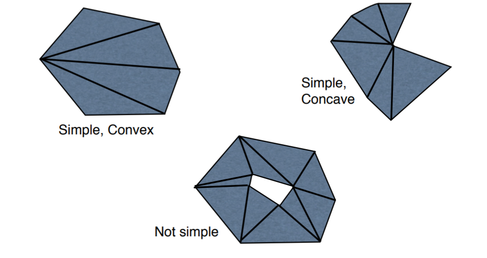

# Week 1A Introduction

## CPU vs. GPU

* CPU consists of a few cores optmized for sequential serial processing
* GPU, on the other hand, has a massively parallel architecture (SIMT/Single Instruction Multiple Thread) consisting of smaller speical purpose cores designed for parallel work.

## Viewport

Viewport is the piece of the screen we are drawing on. In following applications, it is always a rectangle having it own coordinate system.

#### Viewport vs. Screen space

Viewport and screen space rerepsent the same area, whereas they differentiate from coordinates. Viewport is mapped from `[-1, 1]`, while screen is mapped from `[Width, height]`

#### Simple version of pipeline

`local space -> world space -> camera space -> clip space -> view space -> screen space`

## Coordinate system

By default the viewport is centred at `(0, 0)`. The left boundary is at `x = -1`, the right at `x = 1`, the bottom at `y = -1` and the top at `y = 1`.

```
(-1,1)               (1,1)
    +-----------------+
    |        |        |
    |        |        |
    |--------+--------|
    |  (0,0) |        |
    |        |        |
    +-----------------+
(-1,-1)              (1,-1)
```

If the point to be drawn is out of the boundry, you have to scale it down to fit the coordinate system and your window size.

## First tangling with OpenGL

1. Initally, we have two memory spaces - Main Memory and GPU Memory.

2. Then we create a buffer that can store 1 **point**. The buffer is **pinned** in main memory.

    ```java
    Point2DBuffer buffer = new Point2DBuffer(1);
    ```

3. Store the value of this point at index 0 in this buffer

    ```java
    buffer.put(0, this);
    ```

4. Create a new **name** for this buffer in the GPU memory for later referencing

    ```java
    int[] names = new int[1];
    gl.glGenBuffers(1, names, 0);
    ```

5. We bind the buffer previous created to the OpenGL primitive - `GL_ARRAY_BUFFER`

    ```java
    gl.glBindBuffer(GL.GL_ARRAY_BUFFER, names[0]);

    // signature
    void glBindBuffer(int target,   // binding target
                      int buffer);  // referencing the name of the buffer
    ```

    > OpenGl can only have one active buffer of a particular target. Binding a buffer to GL_ARRAY_BUFFER tells OpenGL taht all future operations on the GL_ARRAY_BUFFER are for this buffer.

6. Allocates the buffer in graphics memory and transfers the data from main memory into it

    ```java
    gl.glBufferData(GL.GL_ARRAY_BUFFER, 2 * Float.BYTES, buffer.getBuffer(), GL.GL_STATIC_DRAW);

    // signature
    void glBufferData(
        int target,     // destination
        long size,      // transfer size (in bytes)
        Buffer data,    // source
        int usage       // how it is used
    );
    ```

    > Most common usage:
    >> * `GL_STATIC_DRAW`: Data will be modified once and used many times.
    >> * `GL_DYNAMIC_DRAW`: Data will be modified repeatedly and used repeatedly

7. Tell OpenGl that the buffer contains **vertex** positions, each position has 2 floats associated with it.

    ```java
    gl.glVertexAttribPointer(Shader.POSITION, 2, GL.GL_FLOAT, false, 0, 0);

    // signature
    void glVertexAttribPointer(
        int index,                  // the attribute
        int size,                   // attribute size
        int type,                   // primitive type
        boolean normalized,         // normalize ints
        int stride,                 // padding
        long pointer_buffer_offset  // start
    )
    ```

8. Draw the buffer as a point on the screen

    ```java
    gl.glDrawArrays(GL.GL_POINTS, 0, 1);

    // signature
    void glDrawArrays(
        int mode,       // primitive to draw
        int first,      // starting vertex
        int count       // number of vertices
    )
    ```

9. Delete the buffer in graphics memory

    ```java
    gl.glDeleteBuffers(1, names, 0);

    // signature
    void glDeleteBuffers(
        int n,
        int[] buffers,
        int buffers_offset
    )
    ```
## Vertex

In OpenGL, a vertex is a point that forms part of the definition of a geometric shape. Vertices can have attributes attached to them.

---
<br><br>

# Week 1B Further geometry and Transformations

## MouseListener vs. MouseAdapter

Implementing MouseListener have to implment all of its eight methods (at least leave the blank implementation). On the contrary, implementing MouseAdapter only requires you to implement the specific method you want to implement.

## Tessellation

We can draw polygons by splitting them up into simpler shape (typically triangles)



## Primitives of triangle

#### `GL_TRIANGLES`

Adjacent three vertices form a triangle, connected vertices don't get to be used twice.

```
E.g.
    {0 1 2}
          {3 4 5}
```

#### `GL_TRIANGLE_STRIP`

Every group of 3 adjacent verties forms a triangle. The face direction of the strip is determined by the winding of the first triangle. A vertex stream of n length will generate n-2 triangles.

```
E.g.
    {0 1 2}
      {1 2 3}       starts with index 2 drawing 2-1-3
        {2 3 4}     starts with index 3 drawing 3-2-4
          {3 4 5}   starts with index 4 drawing 4-3-5
```

#### `GL_TRIANGLE_FAN`

The first vertex is always held fixed. From there on, every group of 2 adjacent vertices form a triangle with the first vertex stream of n length will generate n-2 triangles.

```
E.g.
    {0 1 2}
    {0} {2 3}
    {0}   {3 4}
    {0}     {4 5}
```

## Transformation (2D)

**Translation is the process of moving an object in space**

#### Two ways of transformations

1. Extrinsic: An object being transformed or altered within a fixed coordinate system
2. Intrinsic: The coordinate system of the object being transformed (genuine way here)

#### Identity frame

The coordinate frame with:

* an origin at (0,0)
* y-axis vertical and of length 1
* x-axis horizontal and of length 1

#### Transform operations

Transformation includes following operations:

1. `translate(x,y)`: Translation is the process of moving and object in space without changing any other parameters besides spacial positions (e.g., SHAPE/SCALE and etc won't change)
    
2. `rotate(degrees)`: Rotation is rotating objects around the **origin** (i.e., the object will only be rotated around a certain point - origin).

3. `scale(x,y)`: Scaling is to scale along both axes (or scale across only one axis), -1 would flip the original axis.

**All the operations, other than `translate`, will not modify the position of the origin**

> All the transformations can be done by designed compositions (transformed positions of each component (not preferred)

#### Order matters

* `translate().rotate()` != `rotate().translate()`
* `translate().scale()` != `scale().translate()`
* and etc

The reason of that is mainly because that this is a intrinsic transformation. In other words, the object is indirectly transformed based on co-ordinate system

#### Non-uniform scaling then rotating

If we scale by different amounts in the x direction to the y direction and then rotate, we get unexpected and often unwanted results. Angles are not preserved.

#### Rotating about an arbitrary point

To rotate about an arbitrary point say `(x,y)` with `d` degree

1. Translated to the point - `translate(x,y)`
2. Rotate - `rotate(d)`
3. Translate back again - `translate(-x,-y)`

## Model transformation

* Model Transformation: describes how a local coordinate system maps to the world coordinate system.

* Each object in a scene has its own local coordinate system.

#### Coordinate frames

Coordinate system is defined by a coordinate frame: frame defining the direction and scale of the x and y-axes.

## Revision on Vectors

#### Construct a vector by two points

Example:
Point A ------------------------> Point B
(v1, v2)------------------------> (u1, u2)

Vector AB = (u1-v1, u2-v2)

> Vector = Destination - Source

#### Get a point by a point and the vector between them

Example:
Point A ------------------------> Point B
                Vector v

Point A + v = Point B

> Destination = Source + Vector

#### Arithmetic Operations

1. By adding components: AB = (u1, u2); AC = (v1, v2)
</br>
BC = AB + AC
CB = AC + AB

> Vector (SD) = [S]ource_Vector + [D]estination_Vector

2. By subtracting components: AB = (u1, u2); AC = (v1, v2)
</br>
BC = AC - AB
CB = AB - AC

> Vector (SD) = [D]estination_Vector - [S]ource_Vector

3. Magnitude (length)

$$ |{v}| = \sqrt{v_1^2 + v_2^2 + \cdots + v_n^2} $$

4. Normalisation (direction)

$$ \hat{v} = \frac{v}{|{v}|} $$
$$ |{\hat{v}|} = 1 $$

> Zero vector cannot be normalised.

5. Dot product

$$ u \cdot v = u_1v_1 + u_2v_2 + \cdots + u_nv_n $$

* $u \cdot v = v \cdot u$
* $(au) \cdot v = a(u \cdot v)$
* $u \cdot (v + w) = u \cdot v + u \cdot w$
* $u \cdot u = |{u}^2|$

6. Angles

$$ u \cdot v = |{u}| |{v}| cos \theta $$
$$ cos \theta = \hat{u} \cdot \hat{v} $$
$$ u \cdot v > 0 => \theta < 90 $$
$$ u \cdot v = 0 => \theta = 90 $$
$$ u \cdot v < 0 => \theta > 90 $$

7. Normals in 2D

If two vectors are perpendicular, their dot product is 0. I.e., If n = (x,y) is a normal to p = (a,b), then p * n = a*x + b*y = 0. </br>
Unless there is a zero vector, either n = (-y,x) or n = (y,-x)

8. Cross product in 3D

$$ a \times b = 
\begin{pmatrix}
    a_2b_3 - a_3b_2 \\
    a_3b_1 - a_1b_3 \\
    a_1b_2 - a_2b_1 
\end{pmatrix} $$

CAN BE USED TO FIND NORMALS

$$ a \times b = -(b \times a) $$
$$ a \cdot (a \times b) = 0 $$
$$ b \cdot (a \times b) = 0 $$


## Exercise

1. Why OpenGL is low-level.

    OpenGl is not designed to be high level, instead, it is HAL's (Hardware Abstraction Layer). It provides some efficient APIs for even older models and operating systems to achieve the same task as modern models do. In other words, some of operations of OpenGL are manipulating the hardware of the computer.

2. Draw the coordinate frame after each successive transformation

    ```
    CoordFrame2D.identity()
            .translate(-1, 0.5)
            .rotate(90)
            .scale(1, 2)
    ```

    1. Start with identity frame
    2. translate the origin of identity frame along the negative x-axis 1 unit and along the positive y-axis 0.5 units
    3. rotate the new coordinate frame around the new origin counter-clockwise 90 degree
    4. scale the new x-axis for 1 unit and scale the new y-axis for 2 units.


3. What is the vector **v** from P to Q if `P = (4,0), Q = (1,3)` ?

    $$ \textbf{v} = \vec{PQ} = Q - P = (1-4, 3-0) = (-3, 3) $$

4. Find the magnitude of the vector (1,2)

    $$ |\textbf{v}| = \sqrt{1^2 + 2^2} = \sqrt{5} $$

5. Normalize the vector (8,6)

    $$ \hat{\textbf{v}} = \frac{\textbf{v}}{|\textbf{v}|} = (8/10, 6/10) = (0.8, 0.6) $$

6. Find the angle between vectors `(1,1)` and `(-1,-1)`

    $$ cos\theta = \frac{\textbf{v}_1 \cdot \textbf{v}_2}{|\textbf{v}_1||\textbf{v}_2|} = \frac{-2}{2} = -1 \\
    arccos\theta = 180 $$

7. Is vector `(3,4)` perpendicular to `(2,1)`

    $$ [3,4] \cdot [2,1] = 10 \ne 0 $$

    Hence, not perpendicular.

8. Find a vector perpendicular to vector **a** where `a = (2,1)`

    $$ [-1,2] \cdot [2,1] = 0 $$

9. Find a vector perpendicular to vectors **a** and **b** where `a = (3,0,2)` and `b = (4,1,8)`

    $$ a \times b = 
    \begin{pmatrix}
        0 * 8 - 2 * 1 \\
        2 * 4 - 8 * 3 \\
        3 * 1 - 0 * 4
    \end{pmatrix} 
    = [-2, -16, 3] $$

10. Why we are using `FloatBuffer` over `float[]` for OpenGL

    When we are rendering the objects, it generally contains tons of the process of data exchanging (points and etc). Hence, `FloatBuffer` here, a buffer or floating point values pinned (or fixed) in memory, is suitable for passing to a third party library. A float array, `float[]`, is stored in the heap of java kept moving around or copying around during the garbage collection.
