# Week 4 - A

## Recap

* Transformation pipeline
  * Transform a point in 3D:
  $$ P = (p_x,p_y,p_z)^T $$
  * Extend to homogeneous coordinates:
  $$ P = (p_x,p_y,p_z,1)^T $$
  * World matrix can be obtained by model matrix:
  $$ P_w = M_{model}P $$
  * Camera matrix can be obtained by camera matrix:
  $$ P_c = M_{view}P_w $$
  * CVV coordinates can be obtained by project matrix:
  $$ P_{cvv} = M_PP_c $$
  * Clip to remove points outside CVV
  * Perspective division to eliminate fourth component:
  $$ P_n = \frac{1}{p_w}P_{cvv} $$
  * Viewport transformation to window coordinates:
  $$ P_v = M_{viewport}P_n $$
  * `gl_Position` is the point int CVV coordinates
* Pseudodepth
  * Not linear (i.e. A curve rather than a straight line according to the ratio)
  * More precision for objects close to the near plane (the gradient tends to be smaller and smaller - recall the graph) - rounding errors get worse towards far plane

## Computing pseudodepth for fragment

Bilinear interpolation is lerping in 2 dimensions. It works for any polygon.

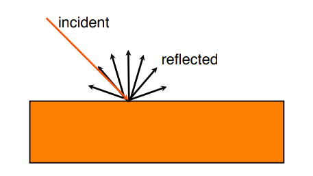

#### Recall linear interpolation

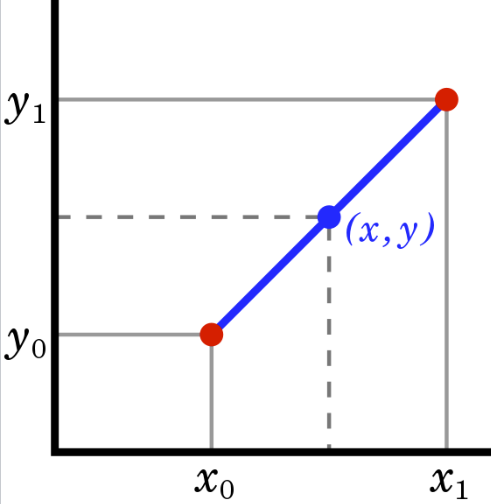

We have,
$$ \frac{x-x_0}{y-y_0} = \frac{x_1-x_0}{y_1-y_0} $$
Solving this equation for y, which is the unknown value at x,
$$ y = y_0 + (x-x_0) \frac{y_1-y_0}{x_1-x_0} \\[2px]
=\frac{x_1y_0-x_0y_0 + xy_1-xy_0-x_0y_1+x_0y_0}{x_1-x_0} \\[2px]
=\frac{y_0(x_1-x)+y_1(x-x_0)}{x_1-x_0}
$$
Similarly,for the polygon demonstrated above, the pseudodepth of R1 is,
$$ f(R_1) = \frac{y-y_1}{y_2-y_1}f(Q_2) + \frac{y_2-y}{y_2-y_1}f(Q_1) $$
The other side,
$$ f(R_2) = \frac{y-y3}{y4-y3}f(Q_4) + \frac{y_4-y}{y_4-y_3}f(Q_3) $$

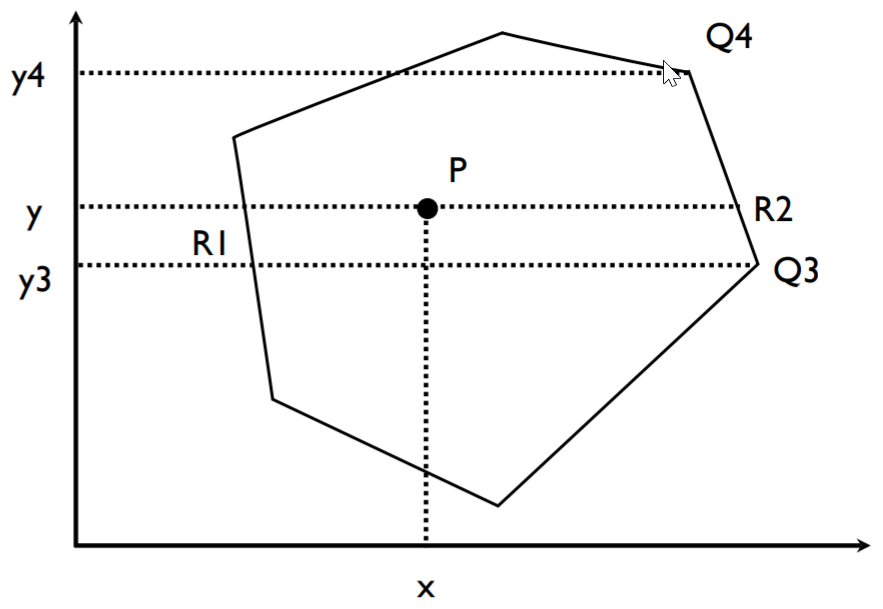

Finally, the pseudodepth of point P will use the x-axis for calculation,
$$ f(P) = \frac{x-x_1}{x_2-x_1}f(R_2) + \frac{x_2-x}{x_2-x_1}f(R_1) $$

<!-- double check the result with tutor -->
Note bilinear interpolation can also be applied on x-axis and then on y-axis.

## Z-fighting

**Caused by the limited precision of depth buffer for two overlapping polygons**

Mainly caused by the limited precision of depth buffer (usually 16 bits). Happens if two or more polygons are parallel small rounding errors will cause them to "fight" for which one appear to be the front.

#### Solution

`glPolygonOffset`: adds a small offset to the pseudodepth of any vertices added after the call. *You can use this to move objects slightly closer or further away from the camera.*

```java
gl.glEnable(
        GL2.GL_POLYGON_OFFSET_POINT);
)
// modify the color buffer
gl.glEnable(
        GL2.GL_POLYGON_OFFSET_LINE);
)
gl.glEnable(
        GL2.GL_POLYGON_OFFSET_FILL);
)
```

```java
gl.glPolygonOffset(
        factor, units);
```
The offset added to the pseudodepth buffer is calculated as:
$$ o = m * factor + r * units $$
where m is the depth slope of the polygon, r is the smallest resolvable difference in depth.

```java
// Push back a bit
gl.glPolygonOffset(1.0, 1.0);

// Push forward a bit
gl.glPolygonOffset(-1.0, -1.0);
```

#### Wrong Solution

Simply positon it slightly closer. The reason why this won't work is that we aren't just see things in one direction in 3D world, while put it closer might cause a obvious gap when viewing from sideways.

## Clipping

Clipping is about to only render the parts we want to see in the camera.
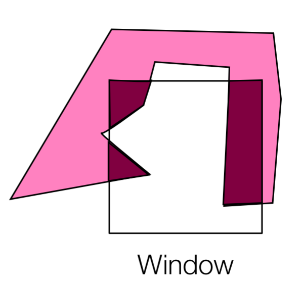

* Clipping algorithms includes
  * Cohen-Sutherland (line vs rect)
  * Cyrus-Beck (line vs convex poly)
  * Sutherland-Hodgman (poly vs convex poly)
  * Weiler-Antherton (poly vs poly)

#### Cohen-Sutherland

Clipping things into an **axis-aligned rectangle**

* Trivial accept or reject

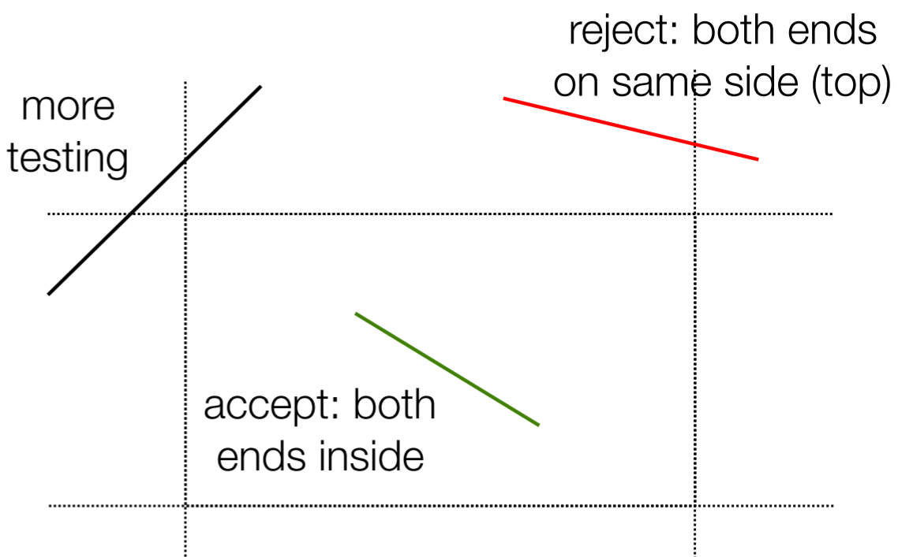

* Labelling

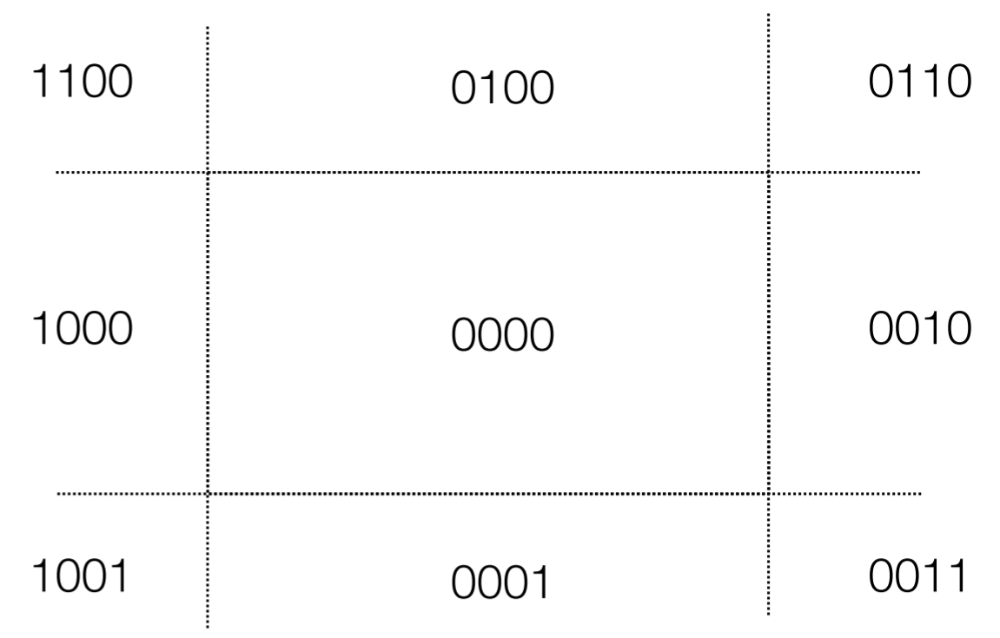

* Label ends

```
Outcode(x,y):
    code = 0;
    if (x < left)   code |= 8;
    if (y > top)    code |= 4;
    if (x > right)  code |= 2;
    if (y < bottom) code |= 1;
    return code;
```

* Clip once

```
// for both ends
ClipOnce(px, py, qx, qy):
    p = Outcode(px, py);
    q = Outcode(qx, qy);

    if (p == 0 && q == 0) {
        // trivial accept
    }

    if (p & q != 0) {
        // trivial reject
    }

    if (p!= 0) {
        // p is outside, clip it
    } else {
        // q is outside, clip it
    }
```

* Clip loop
<!-- How this is looping while  -->
```
Clip(px, py, qx, qy):
    accept = false;
    reject = false;
    while (!accept && !reject):
        ClipOnce(px, py, qx, qy);
```

[More descriptions on YouTube](https://www.youtube.com/watch?v=jQvRA-GiwwA)

* Clipping the point

 Using similar triangles.

 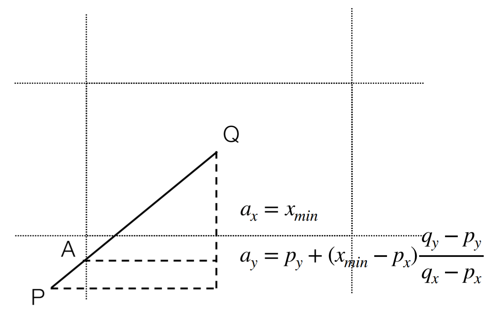
 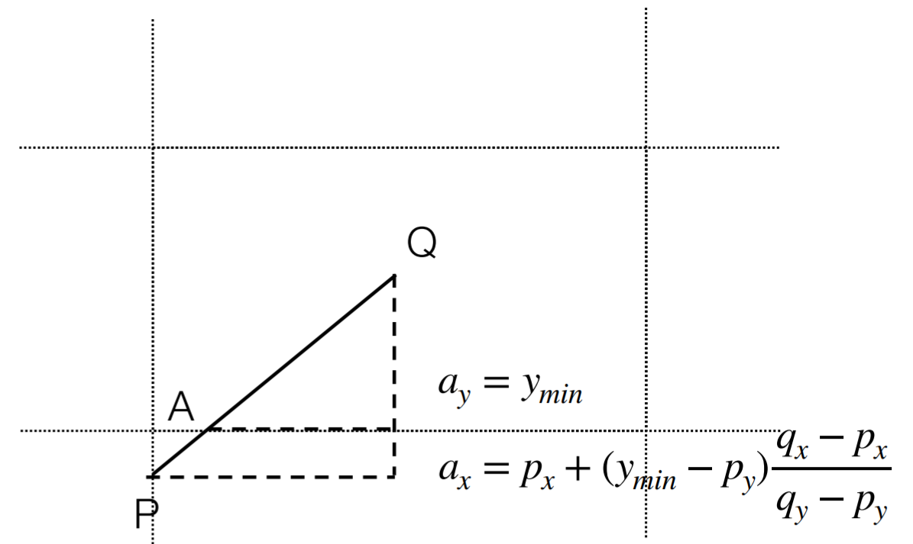

#### Cyrus-Beck

* Initalize $t_{in}$ to 0 and $t_{out}$ to 1
* Compare the ray to each edge of the (convex) polygon
* Compute $t_{hit}$ for each edge
* Keep track of maximum $t_{in}$
* Keep track of minimum $t_{out}$

## Ray colliding with segment

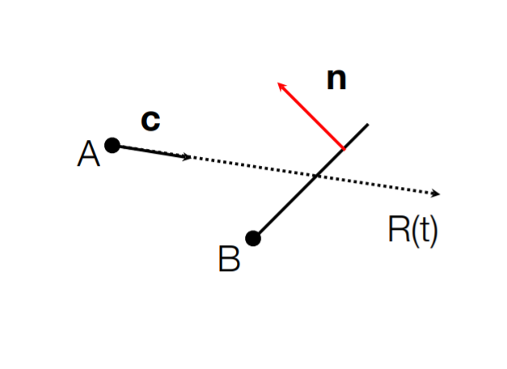

Given

* Parametric ray: $R(t) = A + ct$
* Point normal segment: $\textbf{n} \cdot (P-B) = 0$
* Collide when: $\textbf{n} \cdot (R(t_{hit}) - B) = 0$

#### Hit time

> Following formulae can be deriven from the equations above

$$ t_{hit} = \frac{\textbf{n} \cdot (B-A)}{\textbf{n} \cdot \textbf{c}} $$
$$ P_{hit} = A + \textbf{c} \cdot t_{hit} $$

## Entering / exiting

Firstly, assuming all normals **point out** of the polygon


<br><br>

---

# Week 4 - B

## Meshes

**We represent 3D objects as *polygonal meshes***.

* Triangle meshes are polygonal meshes that only contain triangles.
* At the cost of requiring more memory.

> Triangle mesh:<br>
> A triangle mesh is a type of polygon mesh in computer graphics comprising a set of triangles that are concreated by their common edges or corners.<br>
> It is more efficiently on triangles that are grouped into meshes than on a similar number of triangles that are presented individually because computer graphics do operations on the vertices at the corners of triangles.

#### Data Structures

* Vertex list: all the vertices used in the mesh
* Face list: each face's vertives as indices into the above list

* Examples:

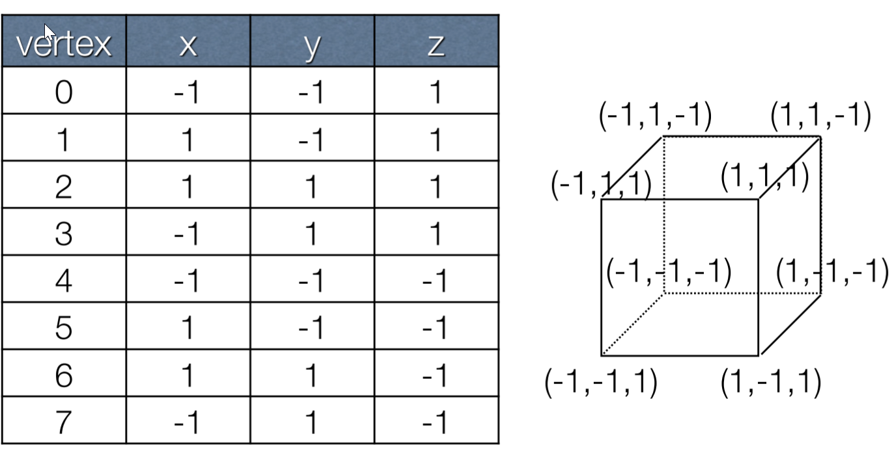
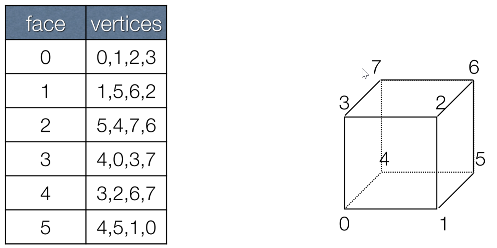

Similarly applying to the triangle mesh instead of polyonal mesh
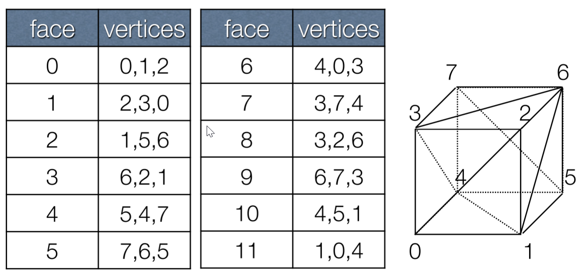

## Indexed Drawing

* Can be used to draw meshes
* Triangles meshes - GL_TRIANGLE
* More on `IndexedCube.java`

#### Implementation

```java
// Draw something using indexed data
gl.glDrawElements(int mode, int count, int type, long offset);
//mode - GL_TRIANGLES etc
//count - number of indices to be used
//type - type of index array
//offset - in bytes
```

#### Efficiency

Transferring a large triangle mesh to the GPU is expensive. It can be saved by simply transfer it once at the initialization of OpenGL engine, `public void init(GL3 gl) {...}`

#### PLY format

> PLY format is known as Polygon File Format. It was principally designed to store three-dimensional data from 3D scanners.<br>
> It stores various properties, including color, transparency, surface normals, texture coordinates and data confidence values.

Normally in format of `keyword` + `statement`
```
comment The header specifies how many vertices and how many faces
comment there are and what format they are in

ply
format ascii 1.0
comment simple cube
element vertex 8            <- 8 vertices
property float x            <- x, y and z coordinates
property float y
property float z
element face 6              <- 6 faces
property list uchar int vertex_indices  <- each face is a list of ints
end_header
```

## Illuminations

#### Achromatic Light

Firstly, we will only consider the illumination which has no color but simply an intensity.

#### Local illumination

* Inter-reflections: light reflects from a light off one object onto another object. So objects with no direct light are not completely in darkness.
* The color of an object in a scene depends on:
    * The color and amount of light that falls on it.
    * The color and reflectivity of the object (e.g., Red object reflects red light)
    * There are two reflections (to be dealt with here): **diffuse** and **specular**

#### Diffuse reflection

Normally happens to the *dull* or *matte* surfaces. Light falling on the surface is reflected uniformly in all directions. **It does not depend on the viewpoint**.


#### Specular reflection

Unlike the diffuse reflection, *polished* surfaces exhibit specular reflections. Light falling on the surface is reflected at the same angle. **Reflections will look different from different viewpoints**.

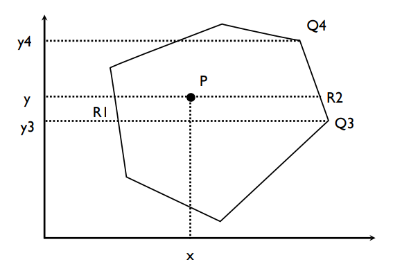

## Light equation

$$ I(P) = I_{ambient}(P) + I_{diffuse}(P) + I_{specular}(P) $$

where $I(P)$ is the amount of light coming from P to the camera.

> We do need to know the following vectors:<br>
> The *normal* vector **m** to the surface at P<br>
> The *view* vector **v** from P to the camera<br>
> The *source* vector **s** from P to the light source

#### Modeling Normals (Normalization)

* Every vertex has an associated normal
* On **flat surfaces**, we want to use *face normals* set the normals perpendicular to the face.
* On the contrary, when on **curved surfaces**, we may want to specify a different value for the normal, so the normals change more gradually over the curvature.
* Smooth vs Flat Normals

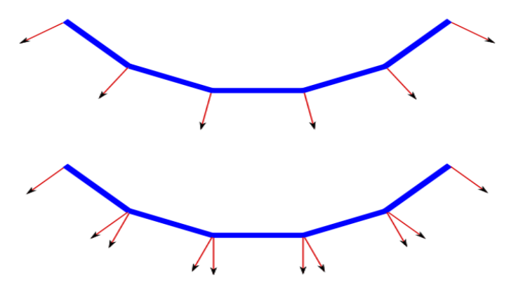

#### Calculation of Face Normals

* Every vertex for a given face will be given the same normal.
* This normal can be calculated by
    * Finding cross product of 2 sides if the polygon is convex
    <!-- TO BE REVIEWED -->
    * Using Newell's method for arbitrary polygons which may not be convex (or even planar)

#### Cross product method

Works for any convex polygons (vertices MUST be in CCW order). Pick two (non-parallel) adjacent edges and calculate:
$$ \textbf{n} = (P_{i+1} - P_i) \times (P_{i-1} - P_i) $$

**If we are looking for the normalized face normals, remember to normalize the result of the cross product. Two unit vectors do not guarantee a unit vector as the result of cross product.**

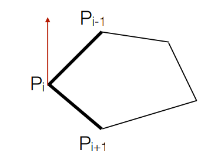

**matrix notation**

$$ \textbf{a} \times \textbf{b} =
\begin{vmatrix}
\textbf{i} & \textbf{j} & \textbf{k} \\
\ a_1 & a_2 & a_3 \\
\ b_1 & b_2 & b_3 \\
\end{vmatrix} \\[2ex]
= (a_2b_3 - a_3b_2)\textbf{i} - (a_1b_3 - a_3b_1)\textbf{j} + (a_1b_2 - a_2b_1)\textbf{k} $$

#### Newell's Method

A robust approach to computing **face normal** for arbitrary polygons:

$$ n_x = \sum_{i=0}^{N-1} (y_i - y_{i+1})(z_i + z_{i+1}) $$
$$ n_y = \sum_{i=0}^{N-1} (z_i - z_{i+1})(x_i + x_{i+1}) $$
$$ n_z = \sum_{i=0}^{N-1} (x_i - x_{i+1})(y_i + y_{i+1}) $$

where ($x_N, y_N, x_N$) = ($x_0, y_0, z_0$)

## Vertex Normals

For smooth surfaces we can calculate each normal based on
* mathematical formula if it is a surface
* averaging the face normals of adjacent vertices

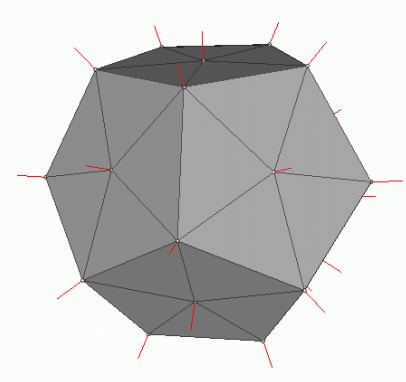

* We keep a separate buffer of normals for a mesh


#### Lambert's Cosine Law (more on diffuse illumination)

$$ I_d = I_s \rho_d (\hat{\textbf{s}} \cdot \hat{\textbf{m}}) $$

* where $I_s$ is the source intensity, and
* $\rho_d$ is the diffuse reflection coefficient in [0,1], 0 for dark surfaces and 1 for light surfaces
* NOTE: Both vectors are normalized

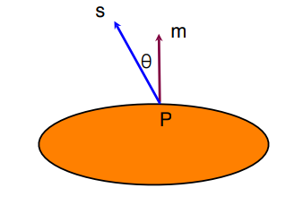

* $\theta$ is equal to 0, $cos(\theta)$ is equal to 1 $\implies$ light is reflected back
* $\theta$ is equal to 90, $cos(\theta)$ is equal to 0 $\implies$ none of the light is reflected back
* $\theta$ is large than 90 $cos(\theta)$ gives negative value
    * However, the light is on the wrong side of surface and the cosine is negative. In this case we want the illumination to be zero.
    * That is what the **Ambient Light** is coming for.

$$ I_d = max(0, I_s\rho_d(\hat{\textbf{s}} \cdot \hat{\textbf{m}})) $$

> Diffuse reflection coefficient:
> * Light surfaces have values close to 1 as they reflect more light
> * Dark surfaces have values close to 0 as they absorb more light

#### Specular reflection

* Only mirrors exhibit perfect specular reflection. On other surfaces there is still some scattering.
* Reflection is brightest around the reflection vector:

$$ \textbf{r} = -\textbf{s} + 2 (\textbf{s} \cdot \hat{\textbf{m}}) \hat{\textbf{m}} $$

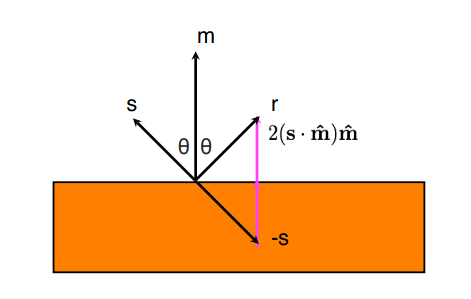

**Be aware of normalization of normal vectors $s$ and $m$**


## Phong model

Phong model allows us to add highlights to shiny surfaces. It looks good for plastic and glass but not good for polished metal (in which real reflections are visible). Because it approximates a statistical distribution of microfacets, but it is not really based on anything real.

Phong reflection describes the way a surface reflects light as a combination of the **diffuse reflection** of rough surfaces with the **specular reflection** of shiny surfaces. It is based on Phong's informal observation that shiny surfaces have small intense specular highlights, while dull surfaces have large highlights that fall off more gradually. The model also includes an **ambient term** to account for the small amount of light that is scattered about the entire scene.

The Phong equation is:

$$ I_{sp} = max(0, I_s \rho_{sp} (\hat{\textbf{r}} \cdot \hat{\textbf{v}})^f) $$

* $\rho_{sp}$ is the specular reflection coefficient in the range [0,1]
* $f$ is the Phong exponent, typically in the ranger [1,128]
* $r$ is the reflection vector
* $v$ is the view vector (vector towards camera)


It can be see that larger values of the Phong exponent $f$ make $cos(\phi)^f$ smaller (vertical axis cutting through a specific phi value) produce less scattering, creating more mirror-like surfaces.

## Blinn Phong Model

It is a modification developed by *Jim Blinn* to the *Phong reflection model*. This model particularly deals with the situation where the angle between viewpoint and the source vector (where the lights come from) is greater than 90 degree. See more details below.

The Blinn-Phong model uses a vector halfway between the source and the viewer instead of calculating the reflection vector.

Experimentally it has been found to produce more accurate reflections.

#### Blinn-Phong Specular light

1. Find the halfway vector

$$ h = \frac{\hat{s} + \hat{v}}{2} $$

2. Then the angle $\theta$ between h and m approximately measures the falloff of intensity.

$$ I_{sp} = max(0, I_s\rho_{sp}(\hat{h} \cdot \hat{m})^f) $$


[Comparison between Phong lighting and Blinn-Phong lighting](https://learnopengl.com/Advanced-Lighting/Advanced-Lighting)

## Ambient light

**What this illumination really does is it add the detail to the back of the object (i.e., $cos\theta$ is negative)**.

Lighting with just diffuse and specular lights gives very stark shadows. In reality, shadows are not completely black. Light is coming from all directions of all objects instead of just single source. While it is computationally expensive to simulate the exact process.

Hence, the solution is to add an *ambient* light level to the scene for each light:

$$ I_{ambient} = I_a \rho_a $$

* $I_a$ is the ambient light intensity
* $\rho_a$ is the ambient reflection coefficient in the ranger (0,1) (usally $\rho_a = \rho_d$)

## Combining Light Contributions

For a particular light source at a vertex:

$$ \begin{aligned}
    I &= I_{ambient} + I_d + I_{sp} \\
      &= I_a\rho_a + max(0, I_s\rho_d(\hat{\textbf{s}}\cdot \hat{\textbf{m}})) + max(0, I_s\rho_{sp}(\hat{\textbf{r}}\cdot\hat{\textbf{v}})^f)
\end{aligned}
$$

For multiple lights, we conclude the lights from components from all of them.

$$ I = \sum_{l \in lights} I_a^l \rho_a + max(0, I_s^l\rho_d(\hat{\textbf{s}}\cdot\hat{\textbf{m}})) + max(0, I_s^l\rho_{sp}(\hat{\textbf{r}}\cdot\hat{\textbf{v}})^f) $$

## Limitations

* Whether V is obscured from a light source by another object or shadows
* Light that strikes V having bounced off other objects

## Other kinds of lights

* The above lighting calculations are based on computing the source vector from a point in the world - point lights.

* Some lights (like the sun) are so far away that the source vector is effectively the same everywhere (parallel) - directional lights.

* To make a light move with an object in the scene make sure it is subject to the same modelling transformation as the object - moving lights.

* Point sources emit equally in all directions for some objects like headlights or torches. A spotlight has a direction and a cutoff angle. Spotlight are also attenuated, so the brightness falls off as you move away from the center.

$$ I = I_s(cos(\beta))^{\epsilon} $$

Where $\epsilon$ is the attenuation factor (exponent)
    


## Exercise

1. Assuming a rectangle with bounds `left = -1, right = 1, bottom = -1 and top = 1`, clip the line from `P = (-1.5, 2) to Q = (0, 0)`.

    1. Apply the `Cohen-Sutherland's Clipping Algorithm` first
    2. Using similar triangle to find the coordinate of new vertices.

2. Given the clipping rectangle with bottom-left corner (1,1) and top-right corner (4,5), apply the Cohen-Sutherland algorithm to clip the following lines:
   
   `A (3, 0) - B (5, 2)`

   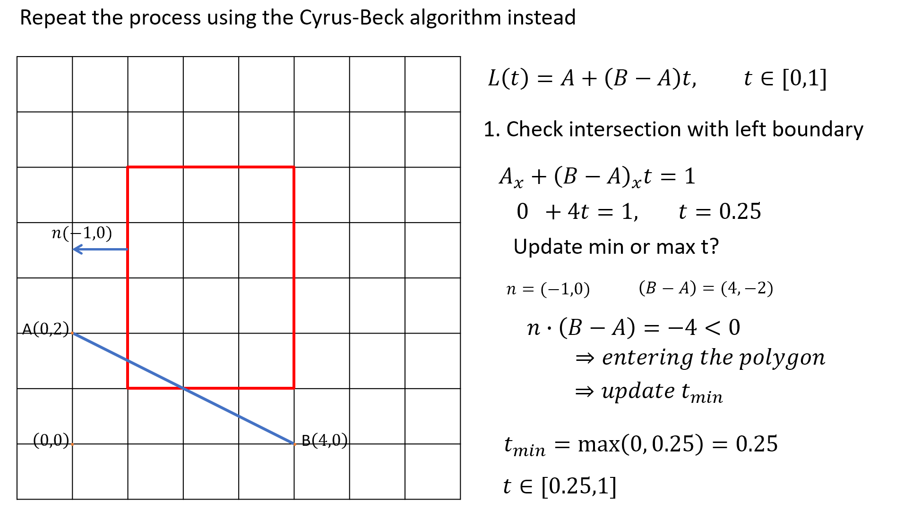
   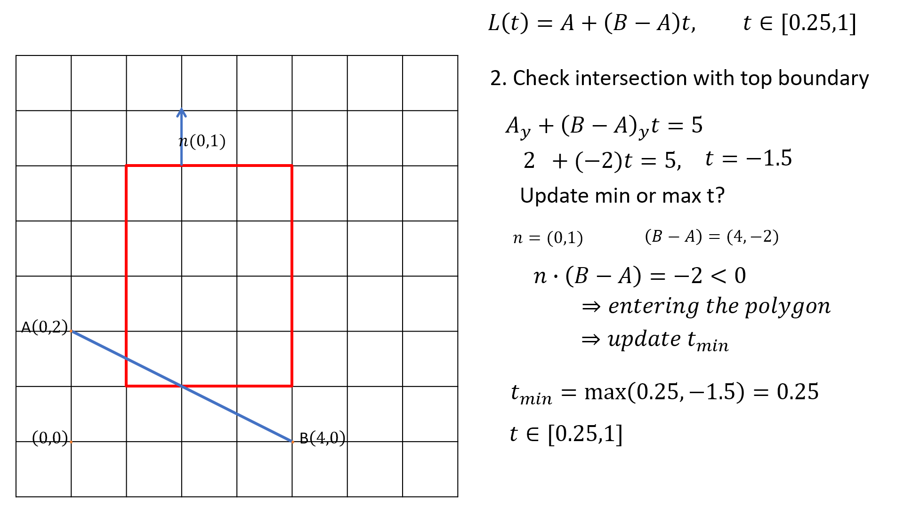
   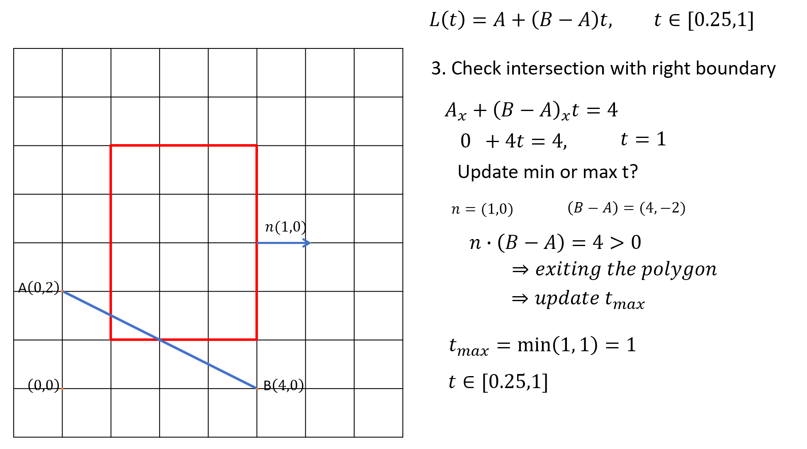
   
   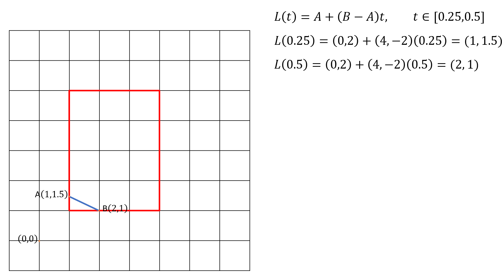