# Week 5 - A

## Recap

|   | LightPos | ViewerPos |
|:-:|:-----:|:------:|
| **Ambient** | FALSE | FALSE |
| **Diffuse** | TRUE | FALSE |
| **Specular** | TRUE | TRUE |

* **Ambient Light** is the light that enters a room that bounces multiple times around the room before lighing a particular object.
	* $I_{ambient} = I_a\rho_a$
* **Diffuse Light** represents direct light hitting a surface.
	* $I_d = max(0, I_s\rho_d(\hat{\textbf{s}} \cdot \hat{\textbf{m}}))$
* **Specular Light** is the white highlight reflecion seen on smooth, shinny objects.
	* $\textbf{r} = -\textbf{s} + 2(\hat{\textbf{s}} \cdot \hat{\textbf{m}})\hat{\textbf{m}}$
	* $I_{sp} = max(0, I_s\rho_{sp}(\hat{\textbf{r}} \cdot \hat{\textbf{v}})^f)$

## Shading

**The following concepts are important when it comes to the calculating of these three shading calculations, where flat shading and gouraud shading are calculated based on the vertex (i.e., gouraud shading is able to calculate the color of the fragment, but still based on vertices because it is interpolated by the vertex), while phong shading is based on the fragment.**

* Three common alternatives:
	* Flat shading - Calculated for each face
	* Gouraud shading - Calculated for each vertex and interpolated for every fragment (the color of the fragment is approximated by the interpolation)
	* Phong shading - Calculated for every fragment

#### Flat Shading

Simplest option is to shade the entire face the same color:

* Compute the intensity for some point on the face
* Set every pixel to that value
* Advantages:
  * Diffuse illumination
  * For flat surfaces with distant light sources
  * Non-realistic/retro rendering
  * It is the fastest shading option

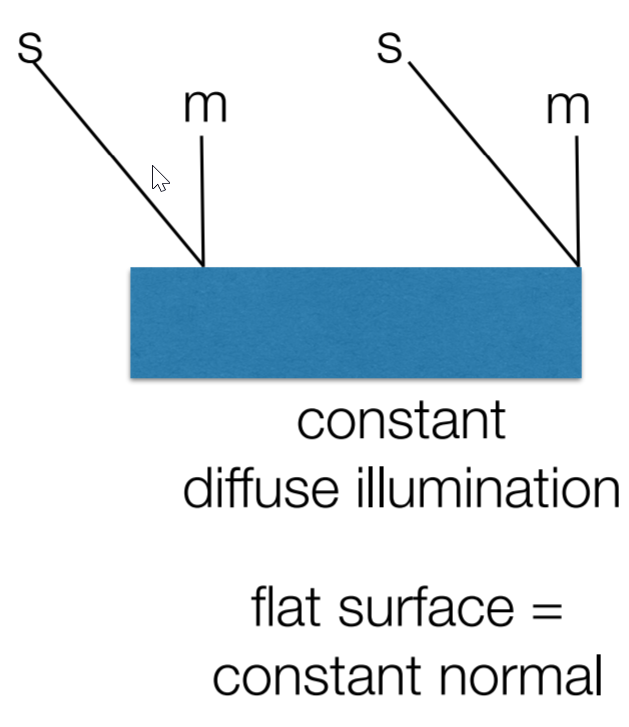

* Disadvantages:
  * Close light sources
  * Specular lighting
  * Curved surfaces

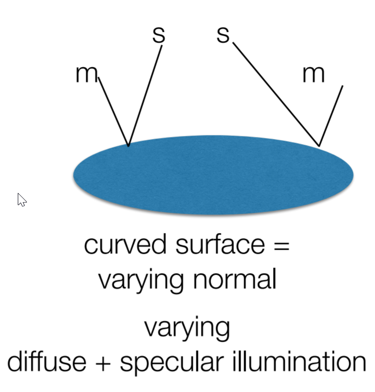

#### Gouraud shading

The lighting equations are calculated for each vertex in the using an associated vertex normal.

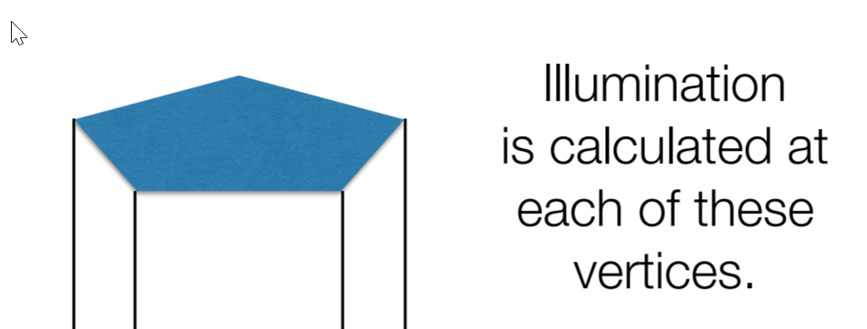

The normal vector ***m*** used to computer the lighting equation is accessed from a buffer the same size as the vertex buffer

```java
gl.glBindBuffer(GL.GL_ARRAY_BUFFER, normalsName);
gl.glVertexAttribPointer(Shader.NORMAL, 
		3, GL.GL_FLOAT, false, 0, 0);
```

Gouraud shading is a simple smooth shading model. We calculate fragment colors by bilinear interpolation on neighboring vertices

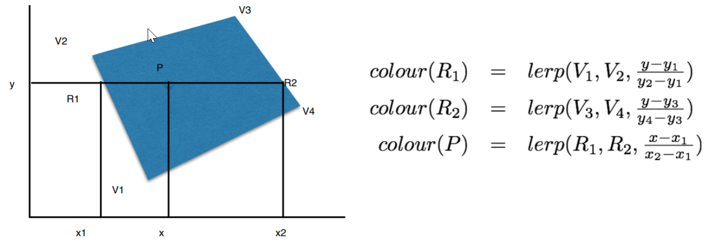

* Advantages:
  * Better than flat shading for:
    * Curved surfaces
    * Close light sources
	* Diffuse shading
* Disadvantages:
  * More expensive than flat shading
  * Handles specular highlighting poorly
    * Works if the highlight occurs at a vertex
	* If the highlight would appear in the middle of a polygon it disappears
	* Highlights can appear to jump around from vertex to vertex with light/camera/object movement
* Implementation
  * Use a vertex shader to do the lighting calculation with the intensity as an output
  * Intensity values are interpolated inputs to the fragment shader
  * Modulate the intensity with the color

#### Phong shading

* Designed to handle specular lighting better than Gouraud. It also handles diffuse better as well.
* Works by deferring the illumination calculation until the fragment shading step.
* Illumination values are calculated per fragment rather than per vertex
* Phong shading approximates ***m*** interpolating the normals of the polygon

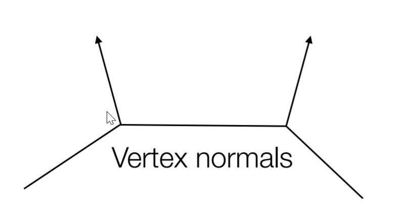
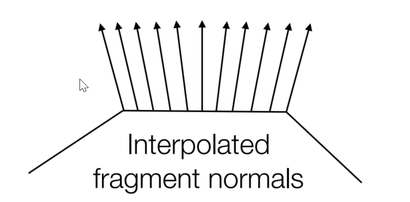

This can be done using bilinear interpolation. However the interpolation normals will vary in length, so they need to be **normalized** before being used in the lighting equation!!!

* Advantages:
  * Handles specular lighting well
  * Improves diffuse shading
  * More physical accurate
* Disadvantages:
  * Slower than Gouraud as normals and illumination values have to be calculated per pixel rather than per vertex, restrained by the speed of computation for the old hardwares.

  ## Lighting Summary

  |	| Where | Good for | Bad for |
  |:-: | :---: | :------: | :-----: |
  | Flat | Face | Flat surfaces, a retro blocky look | Curved surfaces, specular highlights |
  | Gouraud | Vertex | Curved surfaces, diffuse shading | Specular highlights |
  | Phong | Fragment | Diffuse and specular shading | Old hardware |

  * To be improved
    * Two sided lighting
    * Multiple lights
    * Directional lights, spotlight etc
    * Attenuation

## Color

RGB (red, green and blue) components are implemented  separately for:

* Light intensities $I$ $I_a$ $I_s$
* Reflection coefficients $\rho_a$ $\rho_d$ $\rho_{sp}$
* **The lighting equation is applied three times, each of which is for each color.**

#### Colored light and surfaces

The multiplication of 2 vectors is done components-wise i.e.

$$ (u_1, u_2, u_3)(v_1, v_2, v_3) = (u_1v_1, u_2v_2, u_3v_3) $$

```java
// Set the lighting property
Shader.setPoint3D(gl, "lightPos", new Point3D(0, 0, 5));
Shader.setColor(gl, "lightIntensity", Color.WHITE);
Shader.setColor(gl, "ambientIntensity", new Color(0.2f, 0.2f, 0.2f));

//Set the material properties
Shader.setColor(gl, "ambientCoeff", Color.WHITE);
// (R, G, B) - reflects most of the red diffuse light
// and the same mount of few green and blue diffuse light
Shader.setColor(gl, "diffuseCoeff", new Color(0.5f, 0.1f, 0.1f));
// reflected specular light would be composed by mostly
// green and blue
Shader.setColor(gl, "specularCoeff", new Color(0.1f, 0.8f, 0.8f));
Shader.setFloat(gl, "phongExp", 16f);
```

#### Caution

> Using too much light can result with color components becoming 1 (if they add up to more than 1 , they are clamped), which can result in things changing color or turning white.

#### Transparency

A transparent (or translucent) object lets some of the light through from the object behind it.

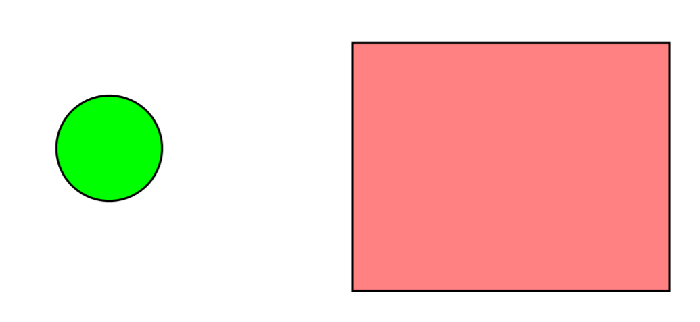
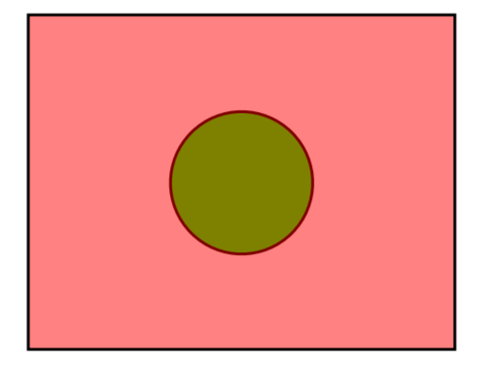

#### The alpha channel

A color is specified by 3 components (RGB). To make things transparent we specify an alpha components as well.

* alpha = 1 means the object is opaque
* alpha = 0 means the object completely transparent (invisible)

#### Alpha blending

**Applying alpha to the new transparent object and (1-alpha) to the background object, which also arise the problem that background object needs to be drawn first (i.e., BACK-TO-FRONT ordering).**

When drawing one object over another, we can blend their colors according to the alpha value. One of the usual blending equations is linear interpolation:

> The alpha channel controls the transparency or opacity of a color. Its value can be represented as a real value, a percentage or an integer: full transparency is 0, whereas full opacity is 1 or 255, respectively.
>
> When a color (source) is blended with another color (background), the alpha value of the source color is used to determine the resulting color. If the alpha value is opaque, the source color overwrites the destination color; if transparent, the source color is invisible.
>
> Alpha blending is the process of combining a translucent foreground color with a background color, thereby producing a new blended color. The degree of the foreground color's translucency may ranger from completely transparent to completely opaque.

$$ \begin{pmatrix}
r \\ g \\ b
\end{pmatrix}
\leftarrow \alpha \begin{pmatrix}
r_{image} \\ g_{image} \\ b_{image}	
\end{pmatrix} + (1 - \alpha)
\begin{pmatrix}
r \\ g \\ b	
\end{pmatrix}
$$

* Example: If the pixel on the screen is currently green, and we draw over it with a red pixel with alpha = 0.25

> The fourth components is the alpha channel.

$$ p = \begin{pmatrix}
0 \\ 1 \\ 0 \\ 1
\end{pmatrix}
\ \ \ p_{image} = \begin{pmatrix}
1 \\ 0 \\ 0 \\ 0.25
\end{pmatrix}
$$

* Then the result is a mix of red and green. However, it is can be ignored after drawing, while the RGB value is critical.

$$ p = 0.25 \begin{pmatrix}
1 \\ 0 \\ 0 \\ 0.25
\end{pmatrix}
+ 0.75 \begin{pmatrix}
0 \\ 1 \\ 0 \\ 1
\end{pmatrix}
\\[2ex] = \begin{pmatrix}
0.25 \\ 0.75 \\ 0 \\ 0.8125
\end{pmatrix}
$$

* OpenGL

```java
// Alpha blending is disabled by default
gl.glEnable(GL2.GL_BLEND);

// other blend functions are also available
gl.glBlendFunc(
		// actual alpha during interpolation
		GL2.GL_SRC_ALPHA,
		// actual (1-alpha) during interpolation
		GL2.GL_ONE_MINUS_SRC_ALPHA
);
```

* Problems

Alpha blending depends on the order that pixels are drawn. Transparent polygons need to be drawn after the polygons behind them. (Depth buffer and similar technique need to be applied, otherwise the object in the back would not be rendered at all) If you are using the depth buffer and you try to draw the transparent polygon before the objects behind it, the later objects will not be drawn.

* Solutions

Hence transparent polygons should be drawn in **back-to-front** order after your opaque ones. Other fudges are to draw your transparent polygons after the opaque ones in any order, but turning off the depth buffer writing for the transparent polygons. This will not result in correct blending, but may be ok.
`gl.glDepthMask(false)`

<br><br>

---

# Week 5 - B

## Curves

The circle drew in the assignment one is essentially a polygon (32-sided polygon). Yet, we want a general purpose solution for drawing *curved lines and surfaces*.

* Be easy and intuitive to draw curves
  
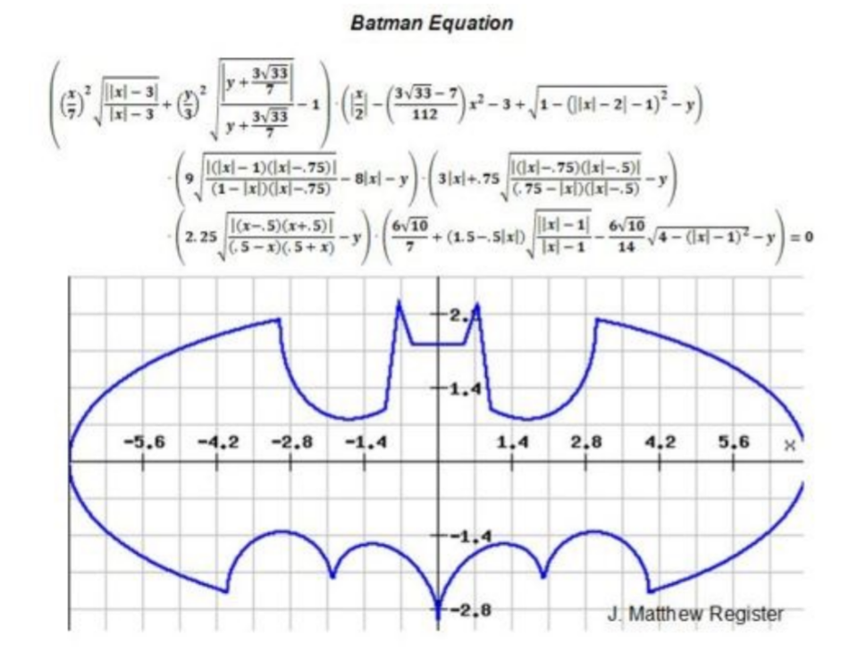

* General, supporting a wide variety of shape

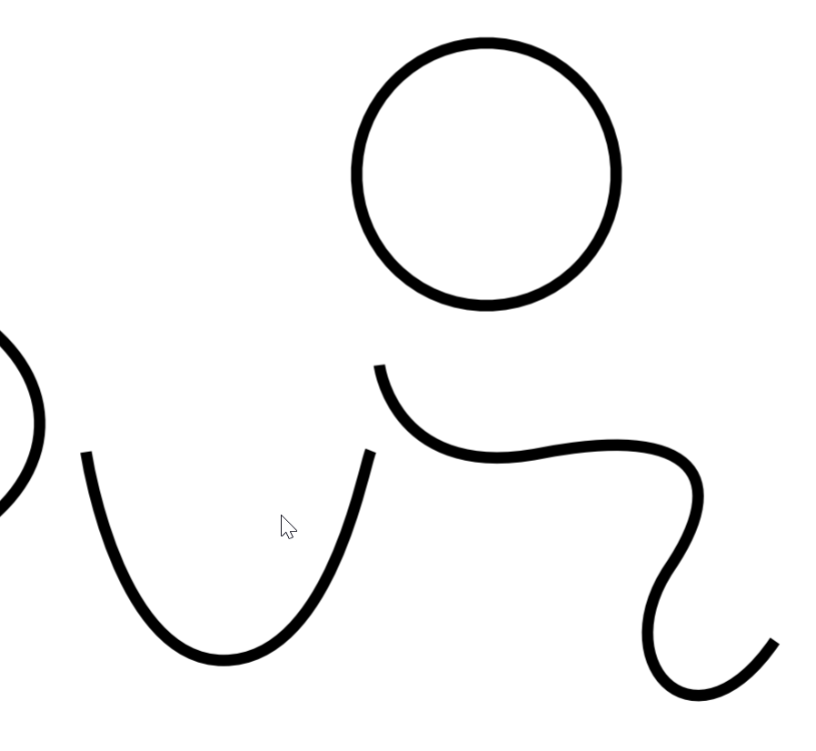

* Be computationally cheap
  * Draw every frame (up tp 60 times a second)

#### Parametric curves

Curves can be expressed in the parametric form:

$$ \begin{pmatrix}
p_1 \\ p_2 \\ p_3
\end{pmatrix} = P(t), \text{for\ } t \in [0,1]
$$

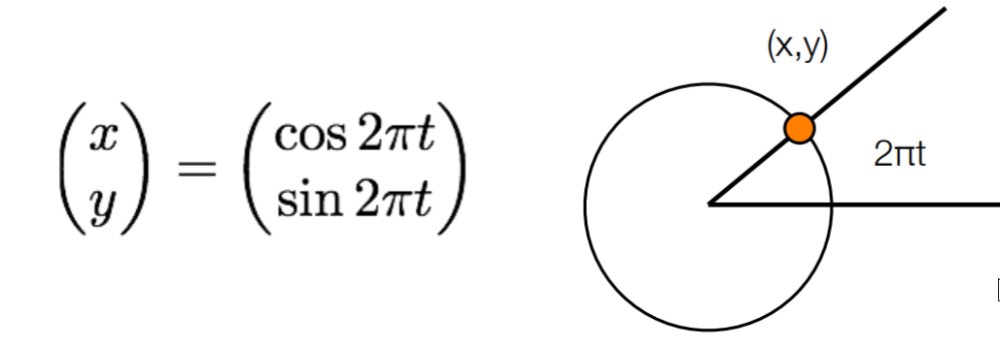

#### Interpolation

One thing to be noted is that trigonometric operations like `sin()` and `cos()` are **expensive** to calculate. In addition, we would like a solution involving fewer floating point operations.

Beside linear interpolation and bilinear interpolation, there is also a quadratic interpolation, which

* Interpolates (passes through) P0 and P2
* Approximates (passes near) P1
* Tangents at P0 and P2 point to P1
* Curves are all parabolas

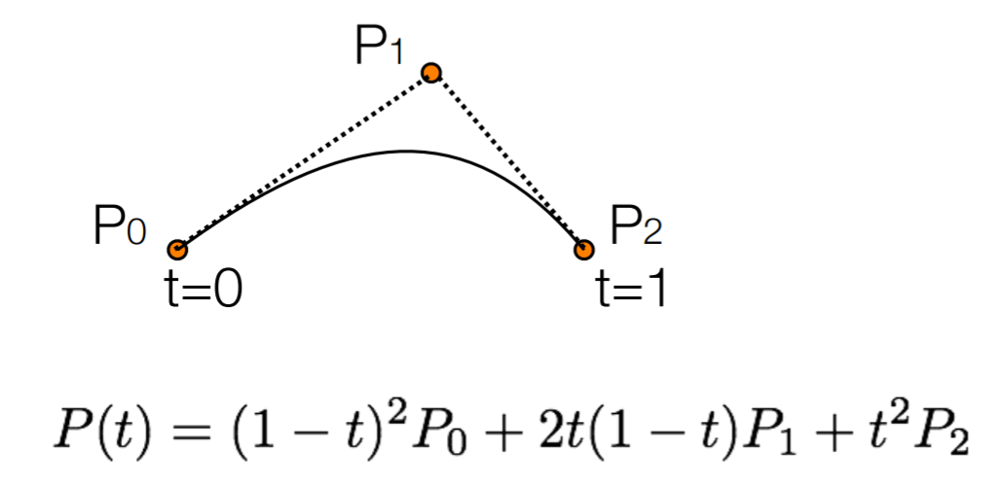

#### de Casteljau Algorithm

The quadratic interpolation above can be computed as three linear interpolation steps:

1. Linear interpolation going through P0 and P1 as $P_{01}$

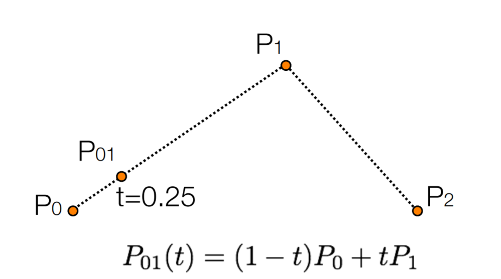

2. Then linear interpolation going through P1 and P2 as $P_{12}$

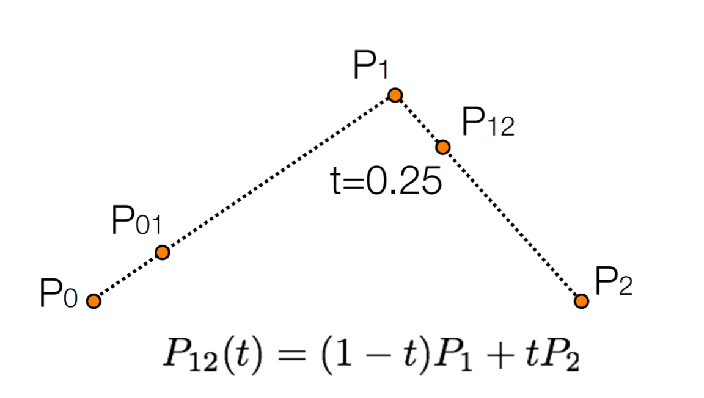

3. Eventually, linear interpolation going through $P_{01}$ and $P_{12}$


3. And the equation for the Curve is defined accordingly

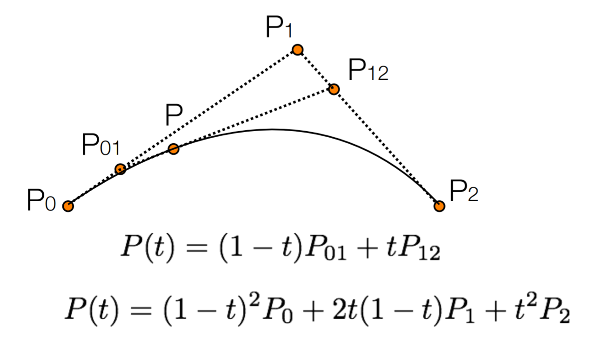

There are many more degrees for curves, of degree 3, 4 and 5, but they are based on the same algorithm. However, there are certain curves that `de Casteljau Algorithm` cannot express, including logarithmatic.

[More in detail](https://www.khanacademy.org/partner-content/pixar/animate/parametric-curves/pi/constructing-curves-using-repeated-linear-interpolation)

Brief proof on that `de Casteljau's algorithm` is equivalent to the `quadratic interpolation` formula

$$ P_{012} = (1-t)P_{01} + tP_{12} \\[2ex]
P_{01} = (1-t)P_0 + tP_1 \\[2ex]
P_{12} = (1-t)P_1 + tP_2 $$

Substitute in, we get

$$ P_{012} = (1-t)^2P_0 + 2t(1-t)P_1 + t^2P_2 $$

#### Cubic interpolation

* Interpolates (passes through) P0 and P3
* Approximates (passes near) P1 and P2
* Tangents at P0 to P1 and P3 to P2
* A variety of curves

Compared with the quadratic interpolation

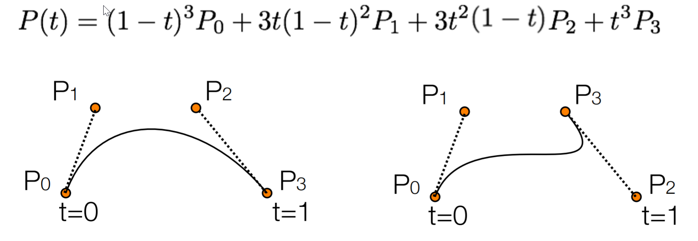

containing several steps:

* Linear interpolation between P0 and P1 as P01, between P1 and P2 as P12 and between P2 and P3 as P23

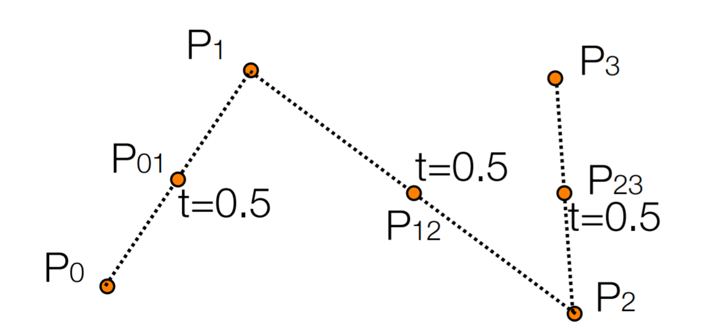

* Linear interpolation between P01 and P12 as P012 and between P12 and P23 as P123

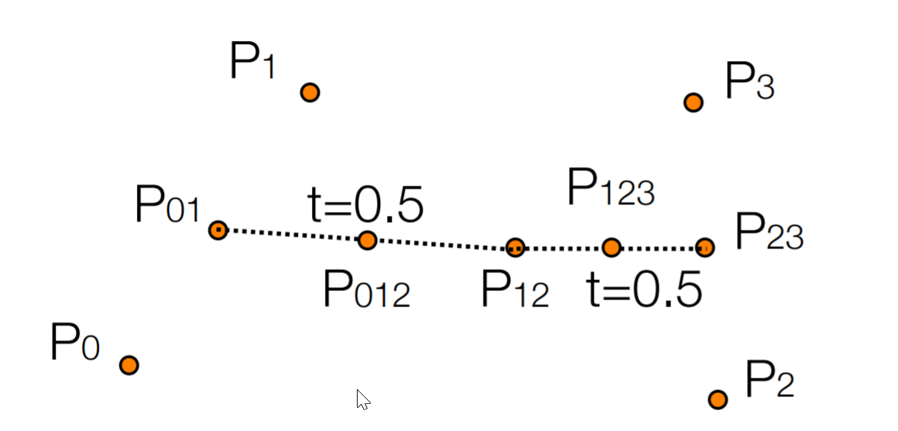

* And finally, linear interpolation between P012 and P123 as P

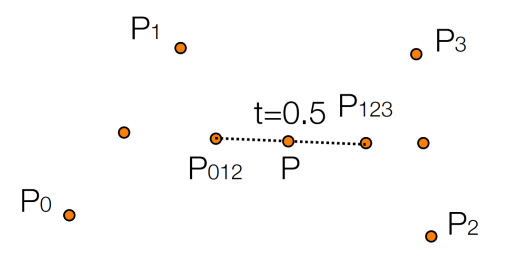
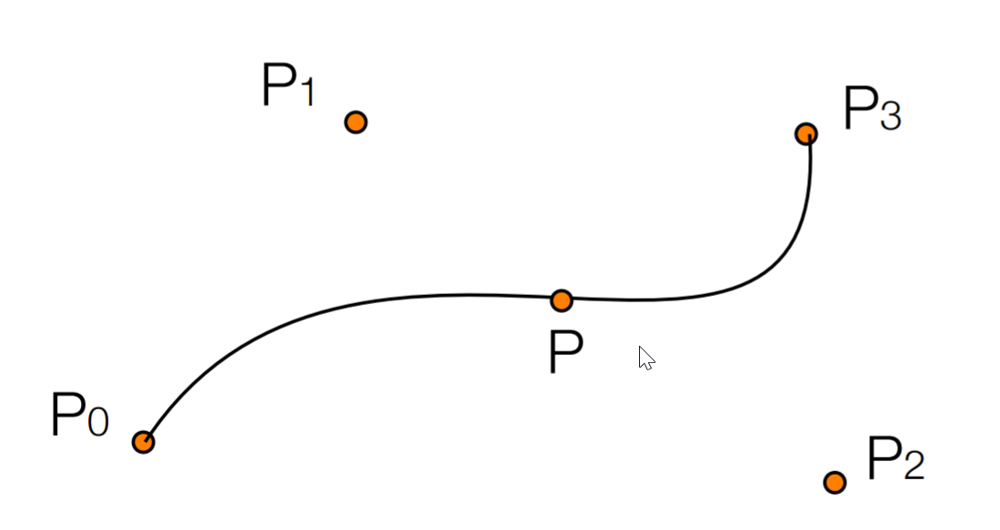

#### Degrees and Order

**Order is how many control points for the current equation, while Degree is the maximum power of the current equation.**

* Linear interpolation: Degree one curve (m=1), Second order (2 control points)
* Quadratic interpolation: degree two curve (m=2), third order (3 control points)
* Cubic interpolation: degree three curves (m=3), fourth order (4 control points)
* Quartic interpolation: degree fourth curve (m=4), fifth order (5 control points)

## Bezier curves

This family of curves are known as Bezier curves of general form:

$$ P(t) = \sum_{k=0}^m B_k^m(t)P_k $$

where $m$ is the degree of the curve and $P_0 \cdots P_m$ are the control points

#### Bernstein polynomials

The     coefficient function $B_k^m(t)$ are called *Bernstein polynomials* of general form:

$$ B_k^m(t) = \binom{m}{k} t^k (1-t)^{m-k} $$

$\binom mk = \frac{m!}{k!(m-k)!}$ is the binomial function

* For the most common case, m = 3:

$$ B_0^3(t) = (1-t)^3 \\[2ex]
B_1^3(t) = 3t(1-t)^2 \\[2ex]
B_2^3(t) = 3t^2(1-t) \\[2ex]
B_3^3(t) = t^3 $$

* Equation for `Bezier curve` of degree 3 order 4 is (combining control points and Berstein polynomials):

$$ (1-t)^3P_0 + 3t(1-t)^2P_1 + 3t^2(1-t)P_2 + t^3P_3 $$

#### Properties

* Bezier curves interpolate their endpoints and approximate all intermediate points
* Bezier curves are convex combinations of points:

$$ \sum_{k=0}^m B_k^m(t) = 1 $$

* Therefore they are invariant under affine transformation. The transformation of a Bezier curve is the curve based on the transformed control points.

#### Tangents

The tangents vector to the curve at parameter t is given by

$$ \begin{aligned} \frac{dP(t)}{dt} &= \sum_{k=0}^m \frac{dB_k^m(t)}{dt}P^k \\
&= m\sum_{k=0}^{m-1}B_k^{m-1}(t)(P_{k+1} - P_k)
\end{aligned} $$

This is a Bezier curve of degree (m-1) on the vectors between control points.

**And of course**, we can using the primitive way of taking the derivative of `Bezier Curve` equation.

Take `Bezier Curve` of degree 2 (m=2) as example.

$$ \begin{aligned}
\frac{d(B_0^2(t)P_0 + B_1^2(t)P_1 + B_2^2(t)P_2)}{dt} \\[2ex]
    &= \frac{d\Big((1-t)^2P_0 + 2t(1-t)P_1 + t^2P_2\Big)}{dt} \\
    &= \frac{-2(1-t)P_0 + [2(1-t)+-2t]P_1 + 2tP_2}{dt}
\end{aligned} $$

#### Problems

1. High degree polygnominals are expensive to compute and are vulnerable to numerical rounding errors
2. Suffering from non-local control - moving one control point affects the entire curve

## Splines

> A **spline** is a smooth piecewise-polynomial function (for some measurement of smoothness). The places where the polynomials join are called **knots**. A joined sequence of `Bezier curves` is an example of a spline.
>
> A spline provides local control, A control point only affects the curve within a limited neighbourhood

#### Bezier splines

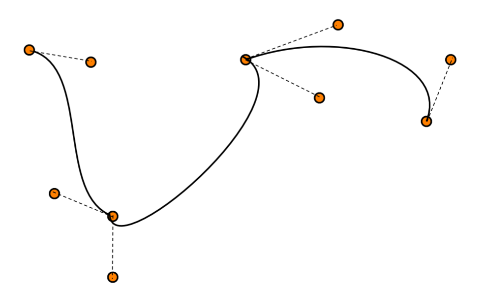

* Bezier splines can represent a large variety of different shapes

## 3D Modeling

To generate meshes dynamically and not just load them from files with a bunch of cubes.

#### Extruding shapes

Extruded shapes are created by sweeping a 2D polygon along a line or curve.

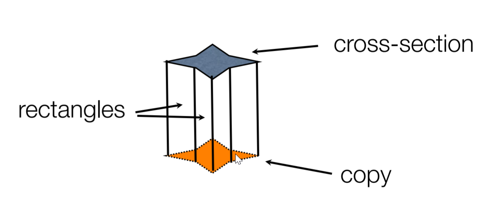

#### Implementation

```java
// We want the sides to be smooth, so make sure the vertices are shared.
    List sides = new ArrayList<>();
    List sideIndices = new ArrayList<>();
    for (int i = 0; i < NUM_SLICES; i++) {
        //The corners of the quad we will draw as triangles
        Point3D f = frontcircle.get(i);
        Point3D b = backCircle.get(i);

        sides.add(f);
        sides.add(b);

        //Indices
        int j = (i + 1) % NUM_SLICES;
        sideIndices.add(2*i);
        sideIndices.add(2*i + 1);
        sideIndices.add(2*j + 1);

        sideIndices.add(2*i);
        sideIndices.add(2*j + 1);
        sideIndices.add(2*j);
    }

    TriangleMesh sidesMesh = new TriangleMesh(sides, sideIndices, true);

    front.init(gl);
    back.init(gl);
    sidesMesh.init(gl);
    meshes.add(front);
    meshes.add(back);
    meshes.add(sidesMesh);
```

#### Variations

One end of the prism can be translated, rotated or scaled from the other

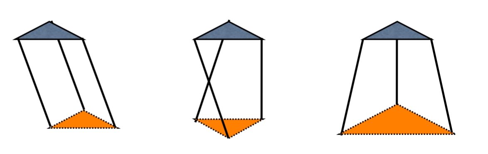

#### Segemented Extrusions

* Example: A polygon extruded multiple times, in different directions with different tapers and twists. The first segement has end polygons $M_0P$ and $M_1P$, where the initial matrix $M_0$ positions and orients the starting end of the extrusions. The second segment has end polygons $M_1P$ and $M_2P$ and etc.

    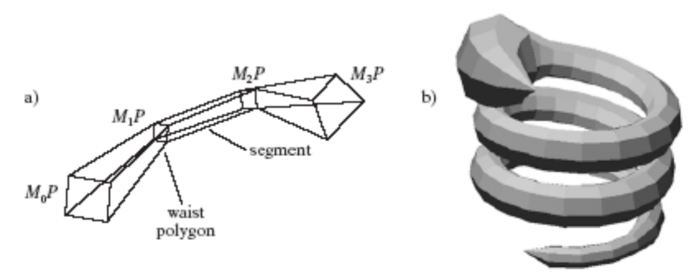

* Generaly idea
  * we can extrude a polygon along a path by specifying it as a series of transformations.

    $$ poly = P_0, P_1, \cdots, P_k $$
    $$path = \textbf{M}_0, \textbf{M}_1, \cdots, \textbf{M}_n $$

  * At each point in the path we calculate a cross section

    $$ poly_i = \textbf{M}_\textbf{i}P_0, \textbf{M}_\textbf{i}P_1, \cdots, \textbf{M}_\textbf{i}P_k $$

  * Sample points along the spine using different values of t
  * For each t:
    * generate the current point on the spine
    * generate a transformation matrix
    * multiple each point on the cross section by the matrix
    * join these points to the next set of  points using quads/triangles

* Another example:
  * we can extrude a circle cross section around a helix spine
  * helix $C(t) = (cos(t), sin(t), bt)$

    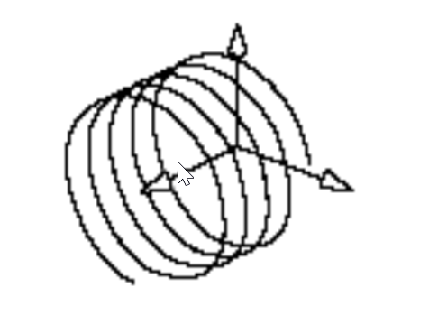

## Frenet Frame

**Altough i-axis is calculated based on the nomralized k vector, it does not guarantee that the i-axis is also normalized. Hence, double check whether i-axis needs to be normalized when it comes to the calculation about it.**

We align the $k$ axis with the (normalized) tangent, and choose values of **i** and **j** to be perpendicular.

$$ \phi = C(t) \\[1ex]
\textbf{k} = \hat{C}'(t) \\[1ex]
\textbf{i} = \begin{pmatrix}
  -k_2 \\ k_1 \\ 0
  \end{pmatrix} \\[1ex]
\textbf{j} = \textbf{k} \times \textbf{i} $$

#### Frenet Frame Calculation

Finding the tangent (**k** vector):

1. Using maths to find the derivatives
2. Or just approximate the tangent
    $$ T(t) = \textbf{normalize}(C(t+1) - C(t-1)) $$

Moving along the frenet frame is simply multiply each point by the frenet frame.

## Revolution

A surface with radial symmetry (i.e., a round object, like a ring, a vase, a glass) can be made by sweeping a half cross-section around and axis.

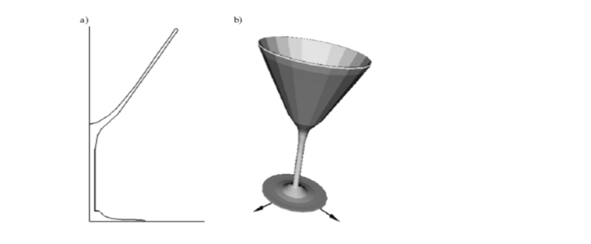

Given a 2D curve: $C(t) = (X(t), Y(t))$

We can then revolve it by adding an extra parameter

$$ P(t, \theta) = (X(t)cos(\theta), Y(t), X(t)sin(\theta)) $$

## L-Systems (Lindenmayer System)

**It is a method for producing fractal structures.**

> They were initially developed as a tool for modelling plant growth.

#### Symbols and Rules

* Symbols:
  * A, B, +, -
* Rules:
  * A -> B - A - B
  * B -> A + B + A

#### Iteration

We start with a given string of symbols and then iterate, replacing each on the left of a rewrite rule with the string on the right.

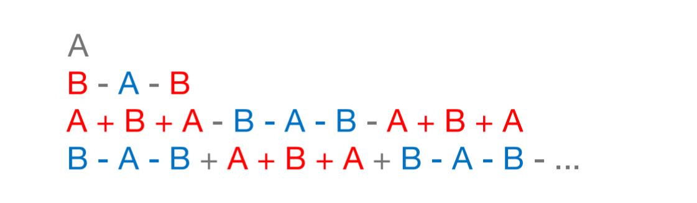

#### Drawing

Each string has a graphical interpretation, usually using turtle graphics commands:

* `A` = draw forward 1 step
* `B` = draw forward 1 step
* `+` = turn left 60 degrees
* `-` = turn right 60 degrees

#### Parameters

We can add **parameters** to our rewrite rules to handle variables like scaling:

* `A(s)` -> `B(s/2) - A(s/2) - B(s/2)`
* `B(s)` -> `A(s/2) + B(s/2) + A(s/2)`
* `A(s)`: draw forwards s units
* `B(s)`: draw forwards s units

#### Push and Pop

We can also use a **LIFO stack** to save and restore global state like position and heading:

* `A` -> `B [ + A ] - A`
* `B` -> `B B`
* `A`: forward 10
* `B`: forward 10
* `+`: rotate 45 left
* `-`: rotate 45 right
* `[`: push
* `]`: pop

#### Stochastic

Add multiple productions with **weights** to allow random selection:

* `(0.5) A` -> `B [ A ] A`
* `(0.5) A` -> `A` <br>
        `B` -> `B B`

## 3D L-Systems

We can build **3D L-Systems** by allowing symbols to translate to models and transformations of the coordinate frame.

* `C`: `draw cylinder mesh`
* `F`: `translate(0,0,10)`
* `X`: `rotate(10,1,0,0)`
* `Y`: `rotate(10,0,1,0)`
* `S`: `scale(0.5,0.5,0.5)`


## Exercise

1. The above shading algorithms ignore some of the special lighting effects including,

    * Shadow
    * Refraction for the transparent materials
    * Scattering
    * Lights that does not directly come from the light source but bounced off other objects
    * Source of the light that actually has a size or a shape
    * Ripple effects

2. To render a polished wooden bowl, how would you generate that mesh? What method would you use to texture it? What would its material properties be for lighting?

    A mesh for the bowl could fairly easily be extruded by taking a vertical cross section through the middle of the bowl and rotating it around the `Y-axis` (creating a surface of revolution). To create the effect of the bowl having been carved out of a solid piece of wood, it would be more appropriate to use a 3D texture of woodgrain rather than try to wrap a 2D texture around this surface.

    The bowl shows both specular and diffuse illumination (notice the specular highlights on the rim and inside the bowl). The specular highlights are broad, suggesting a low shininess value would be appropriate. Phong shading would probably be appropriate to ensure that the surface appears curved and highlights are rendered well. A normal map could be added to give the surface some roughness so that it does't look to glossy.