# Week 6A Textures

## Texturing

* Texturing are a way to add detail to our models without requiring to many polygons
* Textures are used to add:
  * Color
  * Reflections
  * Shadows
  * Bumps
  * Lighting effects
  * etc
* A texture is basically a function that maps texture coordinates to pixel values.

    $$ T(s,t) = \begin{pmatrix}
    r \\ g \\ b \\ a
    \end{pmatrix}
    $$

    * where the left-hand side starts with $T$ is texture coordinates (i.e., texture value at (s,t)) while the right-hand side is the pixel value

* Texture coordinates are usually in ranger (0,1).

* Textures are most commonly represented by bitmaps (2D image files)

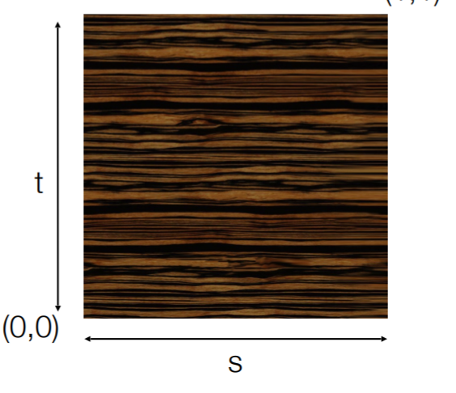

#### Procedural textures

* It is also possible to write code to compute the texture value at a point.
* This can be good to generate materials like marbe or woodgrain.

## Using Textures in `OpenGL`

1. Loading or creating textures
2. Passing the texture to a shader
3. Mapping texture co-ordinates to vertices

#### Loading textures

* Similar yo vertex buffers, we have to create buffers on the GPU and copy into them.

```java
// Setting data to current texture
gl.glTexImage2D(
    GL.GL_TEXTURE_2D,
    0,  // level of detail: 0 = base
    data.getInternalFormat(),
    data.getWidth(),
    data.getHeight(),
    0,  // border (must be 0)
    data.getPixelFormat(),
    data.getPixelType(),
    data.getBuffer()
);
```

#### Texture mapping

* To add textures to surfaces in on our model, we set texture coordinates for each vertex.

* 2D:
    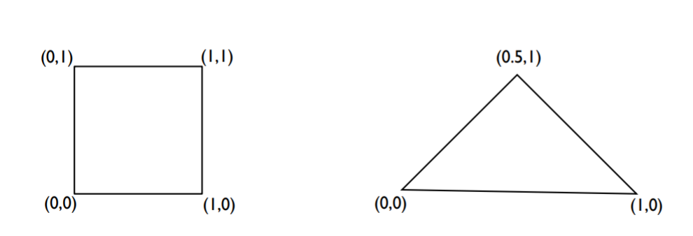
* 3D:
    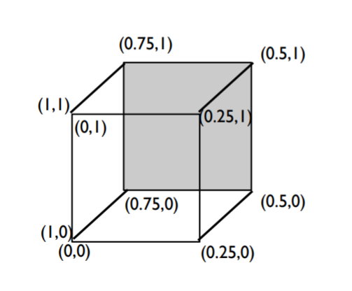

#### Texture Wrap

* You can assign texture coordinates outside the ranger [0,1] and set the texture wrap to

* `GL.GL_REPEAT (default)`
* `GL.GL_MIRRORED_REPEAT`
* `GL.GL_CLAMP_TO_EDGE`

* ```java 
    // 
    GL.GL_CLAMP_TO_BOARDER
    // The boarder color is originally set to black by default.
    GL.GL_BOARDER_COLOR
    ```


```java
// Mapping for multiple dimensions

// Repeat mapping in s dimension
gl.glTexParameteri(
    GL.GL_TEXTURE_2D,
    GL.GL_TEXTURE_WRAP_S, GL.GL_REPEAT
);

// Repeat mapping in s dimension
gl.glTexParameteri(
    GL.GL_TEXTURE_2D,
    GL.GL_TEXTURE_WRAP_T,
    GL.GL_REPEAT
)
```

#### Repeating a Texture

If `GL_REPEAT` is set, the use of texture coordinates outside [0,1] are going to next to the initial texture, like

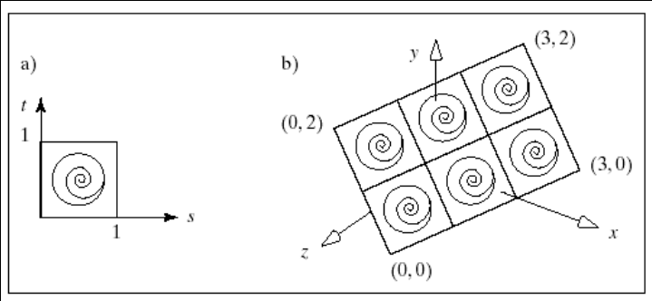

#### Binding the texture

 OpenGL supports up to 32 simultaneously "active" textures, defined by constants `GL_TEXTURE0` up to `GL_TEXTURE31`. These values are distinct from a texture id
  
In the fragment shader, tex is defined as `uniform sampler2D tex;`, while passed by callee with

```java
Shader.setInt(gl, "tex", 0);
gl.glActiveTexture(GL.GL_TEXTURE0);
gl.glBindTexture(GL.GL_TEXTURE2D, texId);
```

To be concluded by a pipeline: sampler2D in fragment shader --(assigned)--> Active texture number --(associated)--> Texture ID

## Textures and shading

One **simple** approach is to wrap up the illumination models with texture enabled (i.e., replace illumination calculations with a texture look-up)

$$ I(P) = T(s(P),t(P)) $$

that produces objects which are not affected by lights or color.

The **common solution*** is to use the texture to modulate the ambient and diffuse reflection coefficients:

$$ I(P) = T(s,t)[I_{\alpha}\rho_{\alpha}+I_d\rho_d (\hat{\textbf{s}} \cdot \hat{\textbf{m}})] + I_s\rho_s(\hat{\textbf{r}} \cdot \hat{\textbf{v}})^f $$

Usually leave the specular term unaffected because it is unusual for the material color to affect specular reflections.

#### Foreshortening

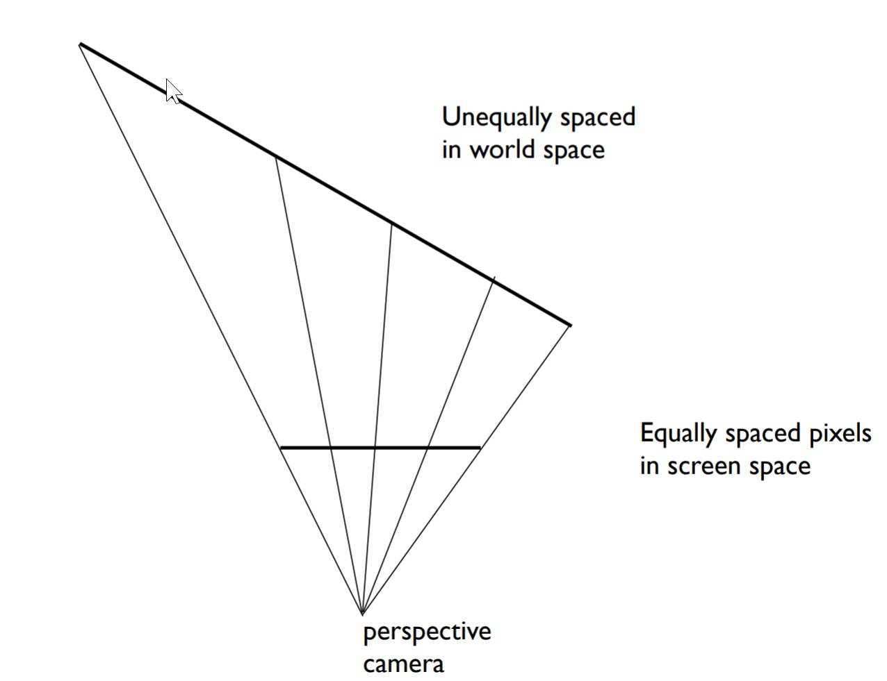

> Foreshortening is the visual effect or optical illusion that causes an object or distance to appear shorten than it actually is because it is angled toward the viewer.
>
> Additionally, an object os often not scaled evenly: a circle often appears as an ellipse and a square can appear as a trapezoid.


#### Rendering the Texture

> Linear vs. correct interpolation example:

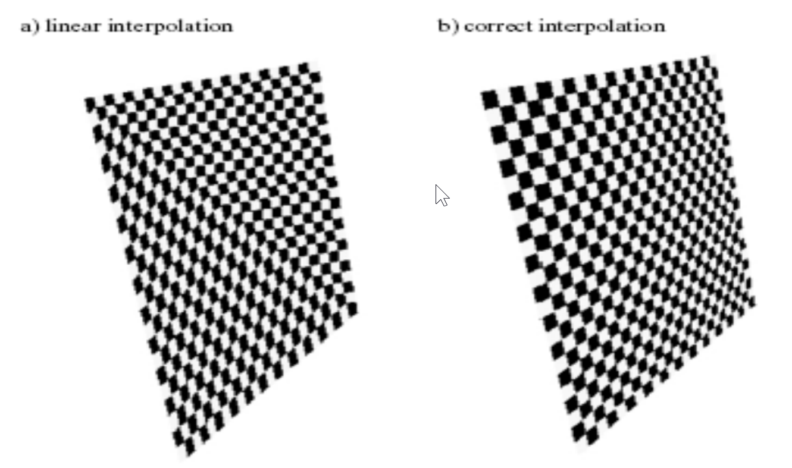

#### Hyperbolic interpolation

While we want texture coordinates to interpolate linearly in world space, the perspective projection distorts the depth coordinate so that linear interpolation in *screen space* $\ne$ linear interpolation in *world space*. And hyperbolic interpolation does fix it.

## 3D textures

3D textures are made by adding an extra texture coordiante, instead of simple repeat in each face. This eliminates weird seams and distortions when a 2D texture is wrapper on a curve 3D surface.

## Magnification

Normal bitmap texture have finite detail (i.e., if we zoom in close we can see individual texture pixels). If the camera is close enough to a textured polygon multiple screen pixels may map to the same texture pixels, resulting in *pixelated* effects.

> Displaying a bitmap or a section of a bitmap at such a large size taht individual pixels, small singel-colored square display elements that comprise the bitmap, are visible. Such an image is said to be pixelated.
>
> Or in plain English, the iamge looks smooth when zoomed out, but when a small section is viewed more closely, the eye cam distinguished individual pixels.

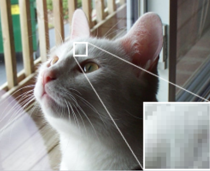

The alignment is probably not exact. The way to solve this is to find the nearest texel.

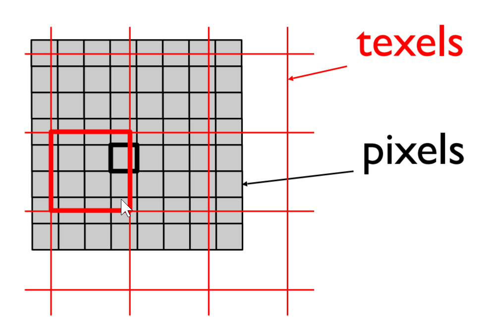

#### Bilinear Filtering

The basic idea is to find the nearest four **texels** (not pixels) and use bilinear interpoaltion over them.

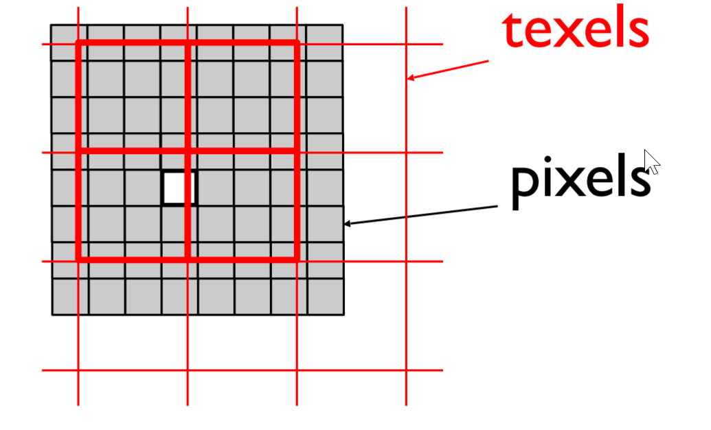

No filtering vs. Filtering

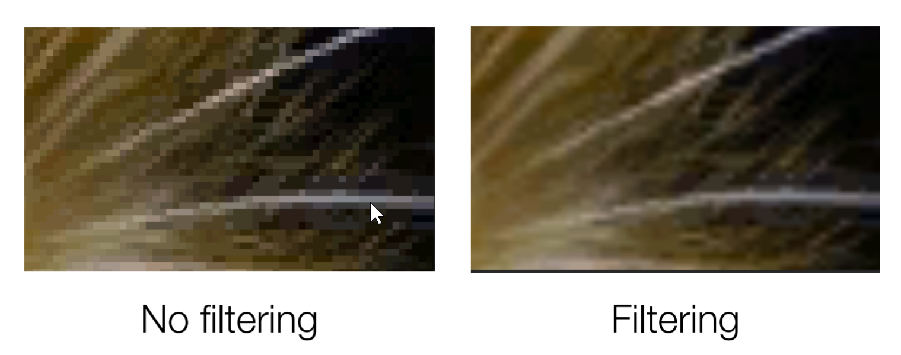

#### Magnification Filtering

```java
// Bilinear filtering
gl.glTexParameteri(GL.GL_TEXTURE_2D,
        GL.GL_TEXTURE_MAG_FILTER,
        GL.GL_LINEAR);
        
// No bilinear filtering
gl.glTexPararmeteri(GL.GL_TEXTURE_2D,
        GL.GL_TEXTURE_MAG_FILTER,
        GL.GL_NEAREST);
```

## Minification

Minificaition, on the other hand, occurs when we zoom out too far from a texture, where we can have more than one texel mapping to a pixel. If image pixels line up with regularities in the texture, strange artefacts appear in the ouput such as moire patterns or shimmering in an animation.

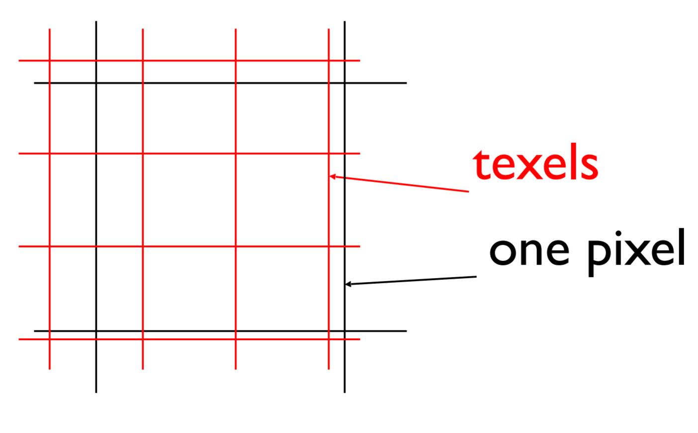

Compared to the **Magnification**, **Minification** indicates that there might be more than one texel mapping to a pixel, while **Maginication** indicates there might be one texel mapping to more than one pixel.


## Aliasing

Aliasing occurs when samples are taken from an image at a lower resolution than repeating detail in the image. Aliasing is an effet that causes different signals to become indistinguishable when sampled.

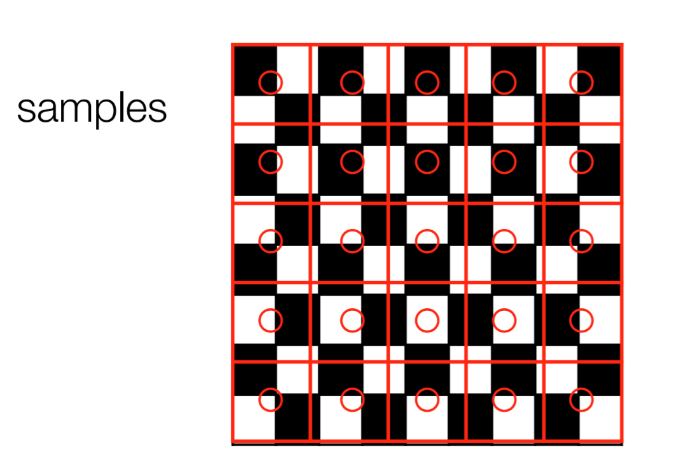
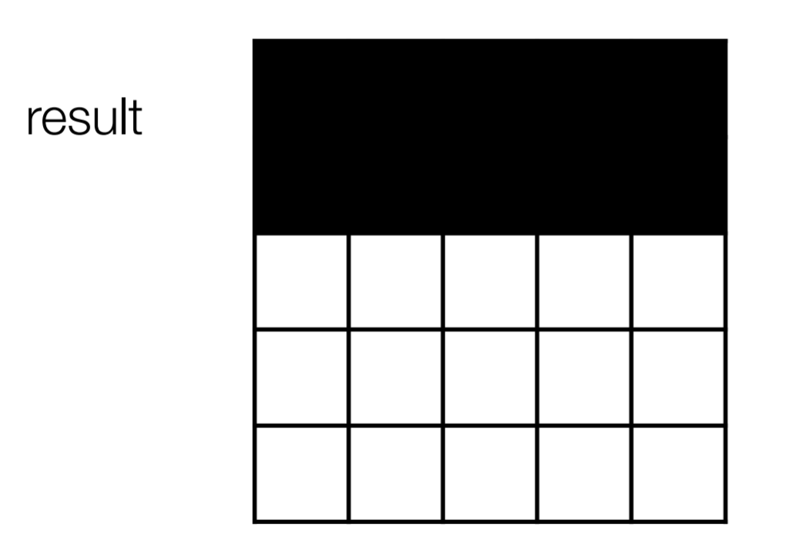

#### Example of Spatial aliasing in the form of a moire pattern

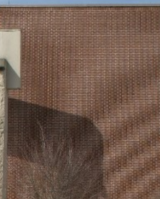

#### Solution

Aliasing is generally avoided by applying *lowe pass filters* or *anti-aliasing* to the input signal before sampling. Suitable *reconstruction filters* should then be used when restoring the sampled signal to the continuous domain.

## Filtering

The problem is that one screen pixel overlaps multiple texels but is taking its value from only one of those texels.

#### Solution

A better appraoch is to **average the texels that contribute to that pixel. However, doing this on the fly is expensive**.

#### Minification Filtering

```java
// Bilinear filtering
gl.glTexPararmeteri(
    GL.GL_TEXTURE_2D,
    GL.GL_TEXTURE_MIN_FILTER,
    GL.GL_LINEAR
);

// No bilineasr filtering
gl.glTexParameteri(
    GL.GL_TEXTURE_2D.
    GL.GL_TEXTURE_MIN_FILTER,
    GL.GL_NEAREST
);
```

## MIP mapping

Mipmaps are precomputed low-resolution versions of a texture. Starting with a 512 $\times$ 512 texture we compute and store 256 $\times$ 256, 128, 64, 32, 16, 8, 4, 2, 1 versions (basically from $2^9$ to $2^0$, 10 groups in total).

This takes total $\frac{4}{3}$ memory of the original.


#### Generating Mip-Maps

```java
// Get opengl to auto-generate
// Mip-maps
gl.glGenerateMipmap(GL.GL_TEXTURE_2D);
```

#### Using mipmaps

The simplest approach is to use the **NEXT SMALLEST MIPMAP** for the required resolution.

> To render a 40 $\times$ 40 pixel image, use the 32 $\times$ 32 pixel mipmap and magnify using magnification filter.

#### MipMap Minification Filtering

```java
// Use nearest mipmap
gl.glTexParameteri(
    GL.GL_TEXTURE_2D,
    GL.GL_TEXTURE_MIN_FILTER,
    GL.GL_NEAREST_MIPMAP_NEAREST
);
```


#### Trilinear filtering

A more costly approach is trilinear filtering by finding the two of the nearest MipMaps and do the linear interpolation on both of them.

1. Use bilinear filtering to compute pixel values based on the next highest and the next lowest mipmap resolutions
2. Interpolate between these values depending on the desired resolution.


#### MipMap Minification Filtering

```java
// Use trilinear filtering
gl.glTexParameteri(
    GL.GL_TEXTURE_2D,
    GL.GL_TEXTURE_MIN_FILTER,
    GL.GL_LINEAR_MIPMAP_LINEAR
);
```

#### Aniso Filtering

If a polygon is on an oblique angle away from the camera, then minification may occur much more strongly in one dimension than the other.

Anisotropic filtering is filtering which treats the two axes independently.

```java
float fLargest[] = new float[1];
gl.glGetFloatv(GL.GL_MAX_TEXTURE_MAX_ANISOTROPY_EXT, fLargest, 0);

gl.glTexParameterf(
    GL.GL_TEXTURE_2D,
    GL.GL_TEXTURE_MAX_ANISOTROPY_EXT,
    fLargest[0]
);
```

#### Aniso Filtering vs. Trilinear Filtering

Trilinear interpolation takes a much bigger sample instead of what it should be (normally, smaller than what it takes). Hence, the far plane (i.e, far end point seeing on an oblique angle away from the camera) will be bluery.

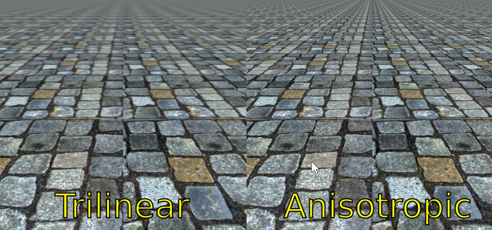

## RIP Mapping

RIP mapping is an extension of MIP mapping which down-samples each axis and is a better approach to anisotropic filtering

> A 256 $\times$ 256 iamge has copies at:
>> 256 $\times$ 128, 256 $\times$ 64, ...<br>
>> 128 $\times$ 256, 128 $\times$ 128, ...<br>
>> 64 $\times$ 256, and etc (all permutations)

#### Limitations

* Does not handle diagonal anisotropy.
* More memory required for RIP maps (4 times as much)
* Not implemetned in OpenGL

## Multi-texturing

Can use mroe than one texture on the same fragment.

```java
gl.glActiveTexture(GL.GL_TEXTURE0);
gl.glBindTexture(GL.GL_TEXTURE_2D, texId1);

gl.glActiveTexture(GL.GL_TEXTURE1);
gl.glBindTexture(GL.GL_TEXTURE_2D, texId2);
```

However, the above code (multi-texturing) have a pre-condition that has to pass two different textures to the shader, and hence two different sets of texture coordinates.

## Animiated textures

Animated textures can be achieved by loading multiple textures and using a different one on each frame.

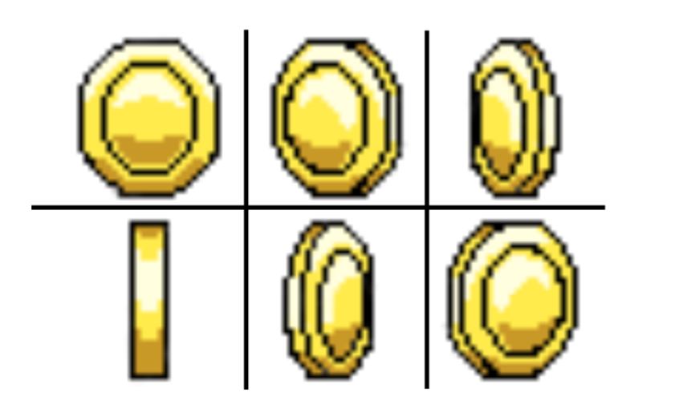

<br><br><br>

---

# Week 6B Textures 2 and Rasterisation

## Rendering to a texture

A common trick is to set up a camera in a scene, render the scene into an offscreen buffer, then copy the image into a texture to use as part of another scene.

> E.g. Implementation a security camera in a game

```java
gl.glCopyTexImage2D(...);
```

## Reflection Mapping

Doing this in general is expensive, but we can make a reasonable approximation with textures

1. Generate a cube that encloses the reflective object.
2. Place a camera at the centre of the cube and render the outside world onto the faces of the cube.
3. Use this image to texture the object.

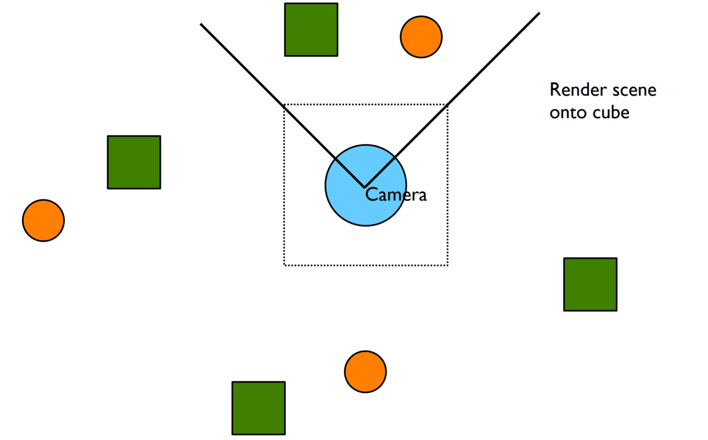

Do the mapping for the rest three faces for 2 dimensional application (supposing fovy is 90 degree here).
However, if it is a 3 dimensional application, another two surfaces (top and bottom) also need to be taken into consideration (such as front, back, left, right, up and down).

To apply the reflection-mapped texture to the object we need to calculate appropriate texture coordinates. This can be done by tracing a ray from the camera, reflecting it off the object and then calculating where it intersects the cube.

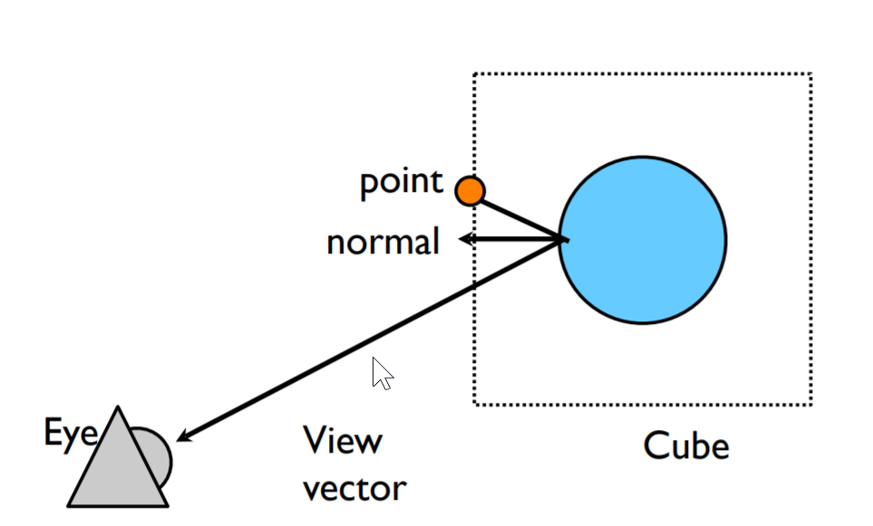

#### Pros and Cons

* Pros: Produces reasonably convincing polished metal surfaces and mirrors.
* Cons:
  * Expensive: Requires 6 additional render passes per object
  * Angles to near objects are wrong.
  * Does not handle self-reflections or recursive reflections

#### Examples for mapping sky boxes

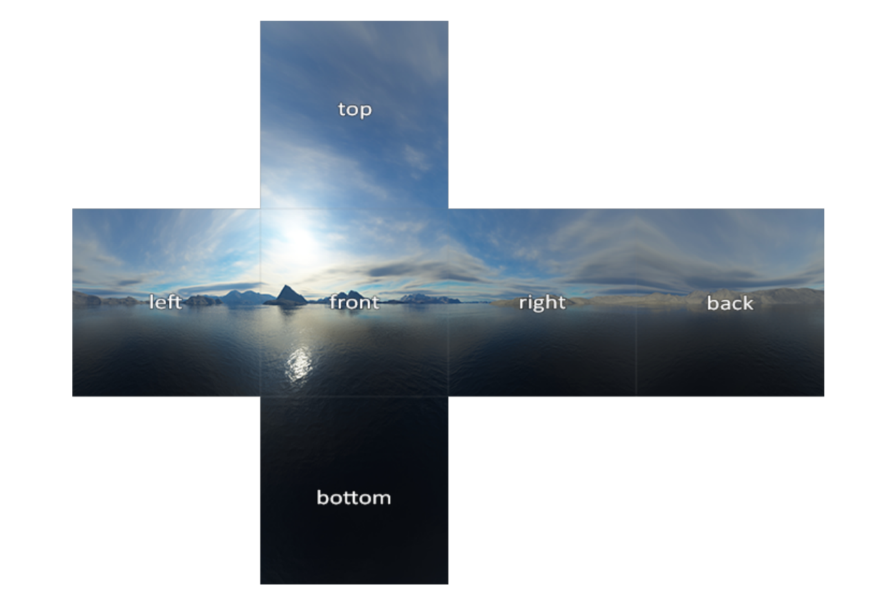

> OpenGl also has sphere mapping support, although this usually produces more distortion and is not as effective as cube mapping.

## Shadows

Out lighting model does not currently produce shadows, which requires taking whether the light source is occluded by another object into account.

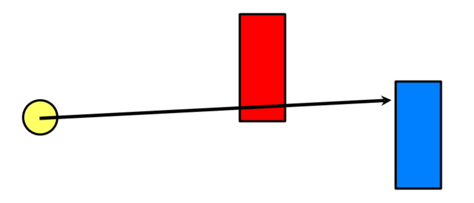

#### Shadow buffering

One solution is to keep a shadow buffer for each light source.

> The shadow buffer is like the depth buffer, it records the distance from the light source to teh cloest object in each direction.

Shadow rendering is usually done in multiple passes:

1. Render the scene from each light's viewpoint capturing only z-info in shadow (depth) buffer (color buffer turned off).
2. Render the scene from camera's point of view, using the previously captured shadow buffers to modulate the fragments.

When rendering a point P:

* Project the point into the light's clip space.
* Calculate the index (i,j) for P in the shadow buffers.
* Calculate the pseudodepth $d$ relative to the light source.
* If shadow [i,j] < $d$ then P is in the shadow.

> Similar to the depth buffer, while it does requires rendering from both of light's perspective and camera's perspective.

#### Pros and Cons

* Pro:
  * Provides realistic shadows
  * No knowledge or processing of the scene geometry is required
* Cons:
  * More computation
  * Shadow quality is limited by precision of shadow buffer. This may cause some aliasing artefacts.
  * Shadow edges are hard. Nowadays, one solution to solve this is when rendering turning the reolsution really high.
  * The scene geometry must be rendered once per light in order to generate the shadow map for a spotlight, and more times for an omnidirectional point light.

## Light Mapping

If our light sources and large portions of the geometry are static then we can precompute the lighting equations and store the results in textures called light maps. Also called *baked lighting*.

#### Pros and Cons

* Pros: Sophisticated lighting effects can be computed at compile time, where speed is less of an issue.
* Cons:
  * Memory and loading times for many individual light maps.
  * Not suitable for dynamic lights or moving objects.
  * Potential aliasing effects depending on the resolution of the light maps.

## Normal Mapping

**What normal mapping does is to render the fake lights for bumps and dents**.

We made assumption that the surface of the polygon is smoothly curved when interpolating normals in a Phong Shader.

> What if the surface is actually rough with many small deformities?

#### Optional solution

One solution would be to increase the number of polygons to represent all the deformities, but this is computationally unfeasible for most applications.

#### Another solution from the Lighting

Instead we use textures called normal maps to simulate minor perturbations in the surface normal.

> In 3D computer graphics, normal mapping is a technique used for fakign the lighting of bumps and dents - an implementation of bump mapping. It is used to add details without using more polygons.

Rather than arrays of colors, normal maps can be considered as arrays of vectors. These vectors are added to the interpolated normals to give the appearance of roughness.

> However, this does not reflect the reality of the shape of the meshes, but only the lighting effects. So, if we really approach the surface close, we won't seee any details for those deformities.

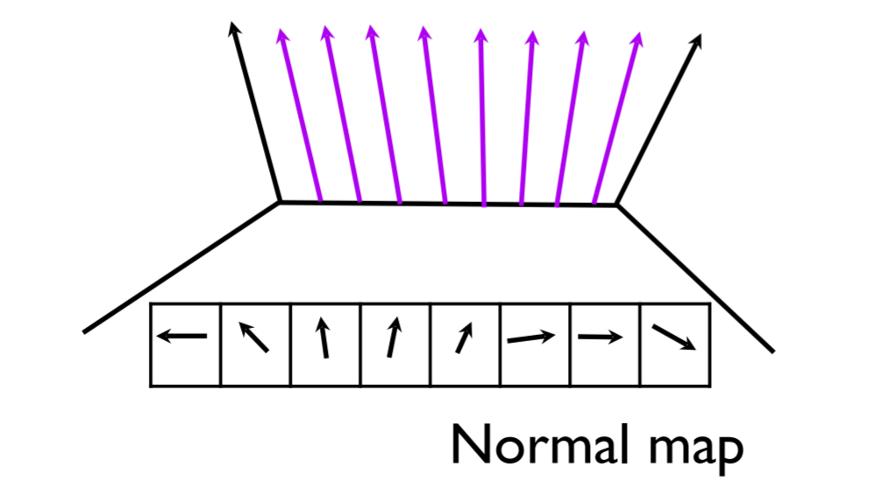
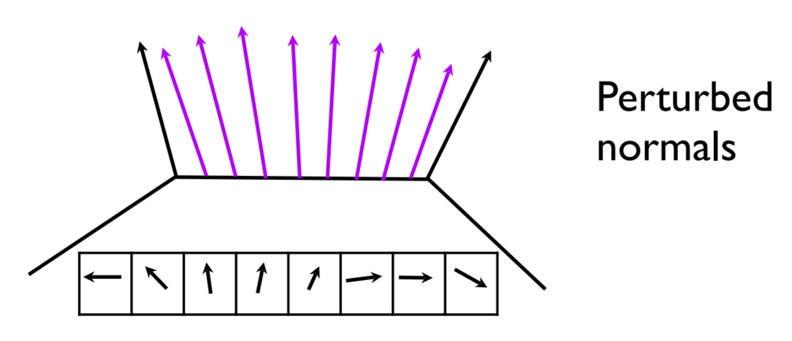

#### Pros and Cons

* Pros: Provide the illusion of surface texture
* Cons:
  * Does not affect silhouette
  * Does not affect occlusion calculation

#### Example

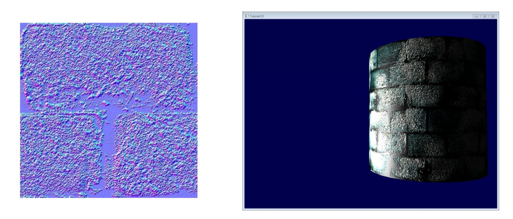

## Rasterisation

**Rasterisation** is the process of converting lines and polygons represented by their vertices into fragments.

**Fragments** are like pixels but include color, depth, texture coordinate. They may also never make it to the screen due to hidden surface removal or culling.

Rasterisation needs to be accurate and efficient. Therefore, simple integer calculations are preferred.

#### Problems with drawing lines in Slope-intercept Form

1. Floating point math is slow and creates rounding errors.
   * Floating point multiplcation, addition and round for each pixel.
2. Code does not consider:
   * Points are not connected if m > 1
   * Divide by zero if x0 == x1 (vertical lines)
     * Does not work for x0 > x1

> Even incremental (replaces multiplication) is still not good enough.

## Bresenham's algorithm

**Assumption**: The line is in the first octant (i.e., x1 > x0, y1 > y0 and m $\le$ 1)

**Idea**:

* For each x we work out which pixel we set next
    * The next pixel with the same y value if the line passes below the midpoint between the two pixels
    * Or the next pixel with an increased y value if the line passes above the midpoint between the two pixels.


**Testing above/below**:

$$ F(x,y) = 2h(x-x_0) - 2w(y-y_0) $$
$$ F(x,y) < 0 \implies (x,y) \text{ is above line} $$
$$ F(x,y) > 0 \implies (x,y) \text{ is below line} $$

> How does the $F(x,y) = 2h(x-x_0) - 2w(y-y_0)$ come from?
>
> To remove the floating number out of the original equation, which is $0 = m(x-x_0) - (y-y_0)$
>> $m$ is a factionaly number (according to the definition of the gradient, $m = \frac{h}{w}$) <br>
>> $y$ is going to be some integer plus 1/2 (midpoints).
>
> Hence, rearrange the equation with replacing $m$ with $h/w$ and multiply 2 to it.

**Pseudocode**:

```java
int y = y0;
int w = x1 - x0; int h = y1 - y0;
int F = 2 * h - w;

for (int x = x0; x <= x1; x++) {
    drawPixel(x,y);
    if (F < 0) F += 2*h;
    else {
        F += 2*(h-w);
        y++;
    }
}
```

#### Example

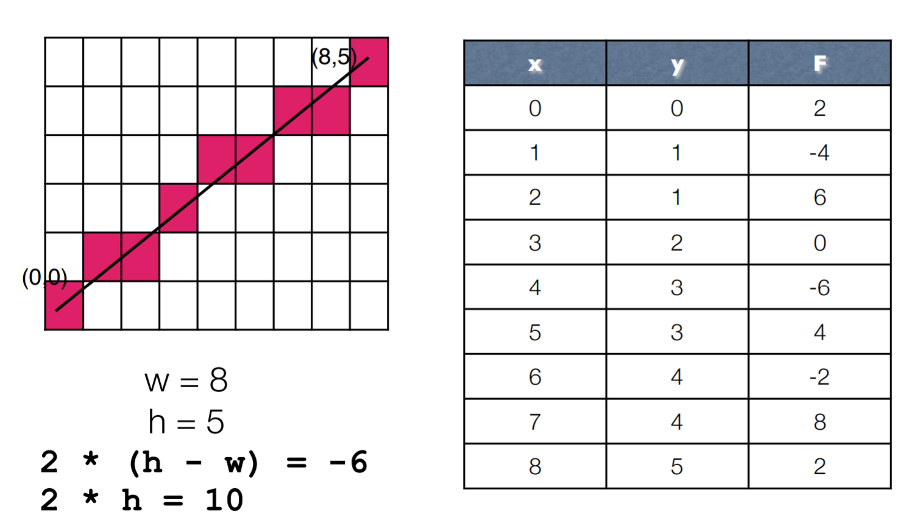

1. The first pixel drawn at (0,0) because
   * The first pixel to be drawn anyway
   * $F = 2 * h - w = 2 * 5 - 8 = 2 \ge 0$

2. The second pixel drawn at (1,1) because
   * $F = 2 \ge 0$ previously. Hence, `y++`, resulting y increasing to 1 from 0, where x increasing by 1 anyway.

3. And etc...

> Relxing restrictions
>
>> Lines in the other quadrants can be drawn by symmertical versions of the algorithm.
>>
>> Careaful that drawing from P to Q and from Q to P set the same pixels.
>>
>> Horizontal and vertical lines are common enough to warrant their own optimised code.

## Polygon filling

1. Determining which pixels are inside a polygon is a matter of applying the edge-crossing test (week3.md) for each possible pixel.

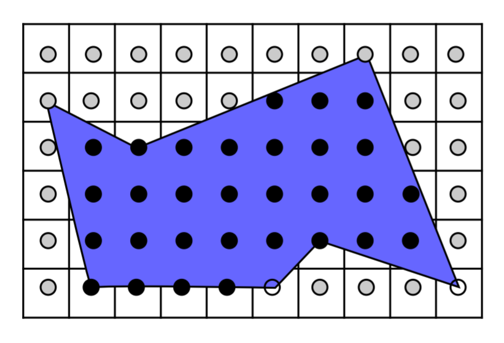

> Tracing a ray horizontally crossing a polygon, even interceptions indicating outside, while odd interceptions indicating inside, on the contrary.
>
> Such a solution does involve some of the problems.
>> Shared edges: If the pixel is on the edge of a polygon, whether should we draw it? What if two polygons are adjacent?
>>
>> Performance: Do we have to do the dege crossing test for every pixel?

#### Shared edges

Pixels on shared edges between polygons need to be drawn consistiently regardless of the order the polygons are drawn, with no gaps.

To simplify and hendce form a rule: **The edge pixels belong to the rightmost and/or upper polygon (i.e., do not draw rightmost or uppermost edge pixels).**

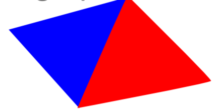

## Scanline algorithm

And hence, we are introduced with a efficient algorithm to solving the problem, where fills the polygon.

As testing every pixel is very inefficient, whereas that checking where the result *changes value* (i.e., when crossing an edge) is crucial. In addition, we proceed row by row with:

1. Calculating intersections incrementally
2. Sorting by x value
3. Filling runs of pixels between intersections

forming a Edge Table.

#### Edge table

The edge table is a lookup table indexed on the y-value of the lower vertex of the edge. Horizontal edges are not added.

We store the x-value of the lower vertex, the increment (inverse gradient) of the edge and the y-value of the upper vertex.

##### Example

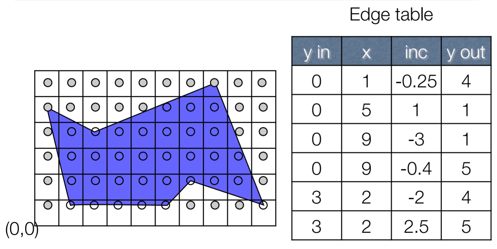

#### Active Edge List (AEL)

We keep a list of active edges that overlap the current scanline. Edges are added to the list as we pass the bottom vertex, removed from the list as we pass the top vertex. The edge intersection is updated incrementally.

#### Edges

For each edge in the AEL we store

* The x-value of its crossing with the current row (initially the bottom x value)
* The increment (inverse gradient)
* The y-value of the top vertex

##### Pseudocode

```java
// For every scanline
for (y = minY; y <= maxY; y++) {

    remove all edges that end at y

    for (Edge e : active) {
        e.x = e.x + e.inc;
    }

    add all edges that start at y - keep list sorted by x

    for (int i = 0; i < active.size; i += 2) {
        fillPixels(actiev[i].x, active[i+1].x, y);
    }
}
```

##### Example

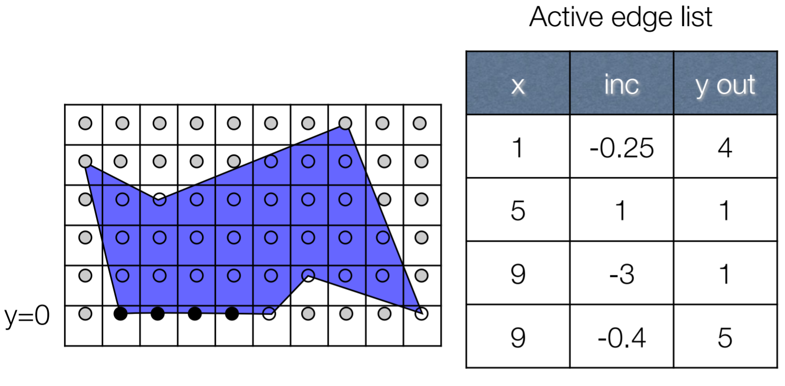


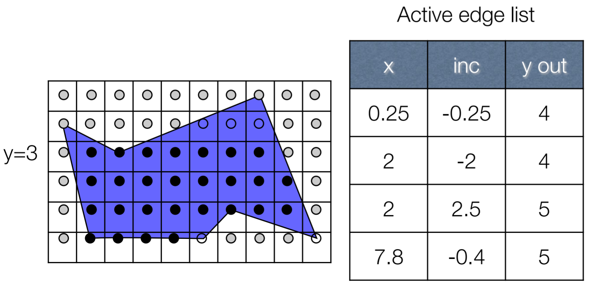
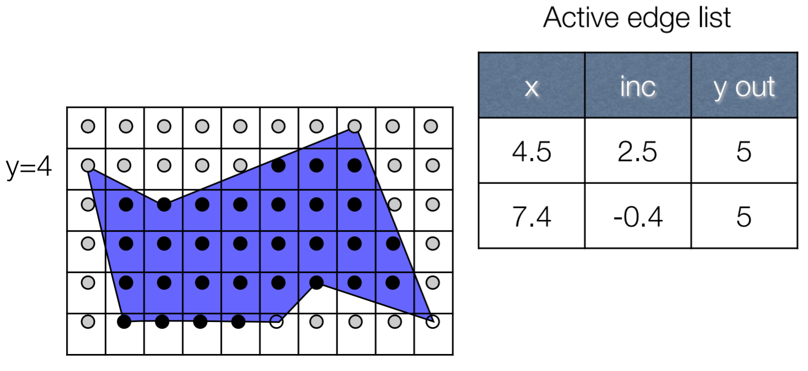


> If polygons are convex the active edge list always has 2 entries.

## Aliasing

Lines and polygons drawn with these algorithms tend to look jagged if the pixel size is too large. I.e.,

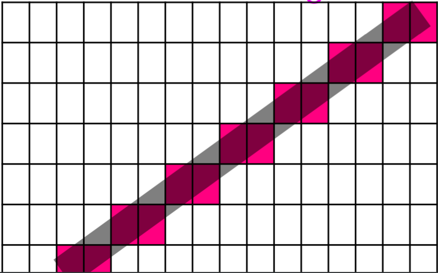

#### Antialiasing

There are two basic approaches to eliminiate aliasing (AKA. antialiasing).

* Prefiltering: computing exact pixel values geometrically rather than by sampling.
  * Prefiltering is most accurate but requires more computation.
* Postfiltering: taking samples at a higher resolution (supersampling) and then averaging.
  * Postfiltering can be faster. Accuracy depends on how many samples are taken per pixel. More samples means large memory usage.

#### Prefiltering

For each pixel, computing the amount occupied and set pixel value to that precentage (i.e., how much of a pixel's area is covered by a object). And based on that precentage dimming or brightening the pixel.

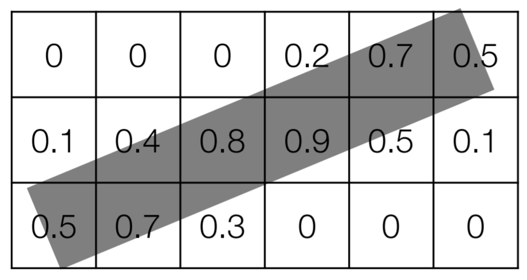


#### Postfiltering

Draw the line at higher resolution and average (supersampling). In terms of postfiltering or supersampling, it is the process by which aliasing effects in graphics are reduced by increasing the frequency of the sampling grid and then average the results down.

This process means calculating a virtual image at a higher spatial resolution than the frame store resolution and then averaging down to the final resolution.

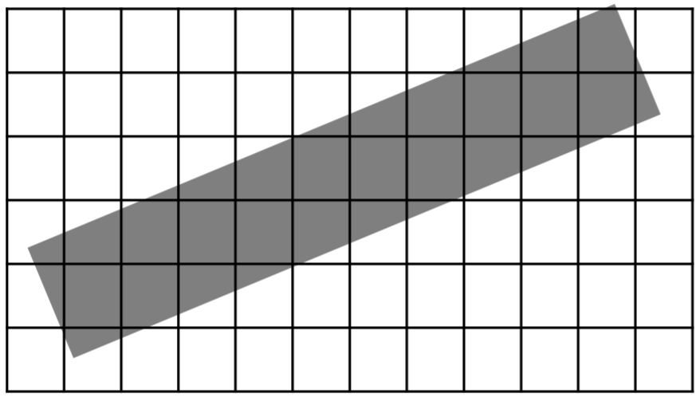
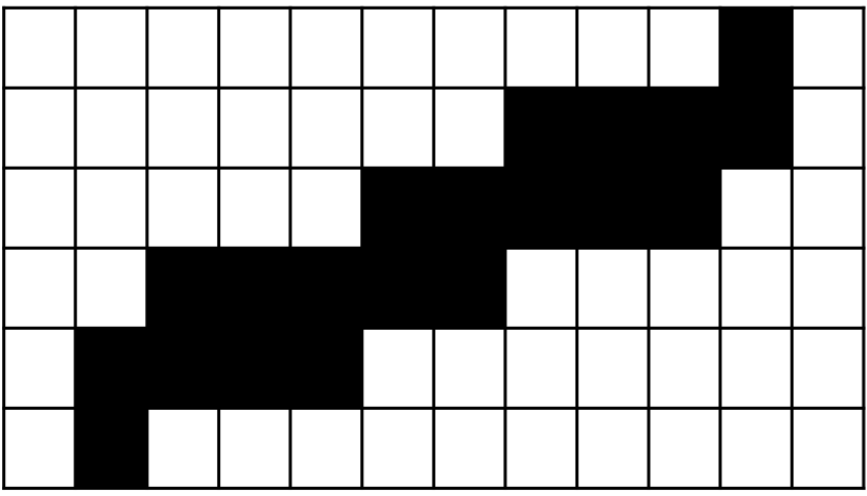

And final result,

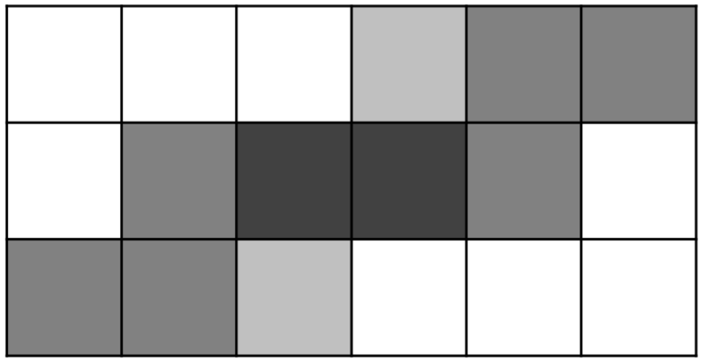

##### Weighted postfiltering

It is common to apply weights to the samples to favour values in the centre of the pixel.

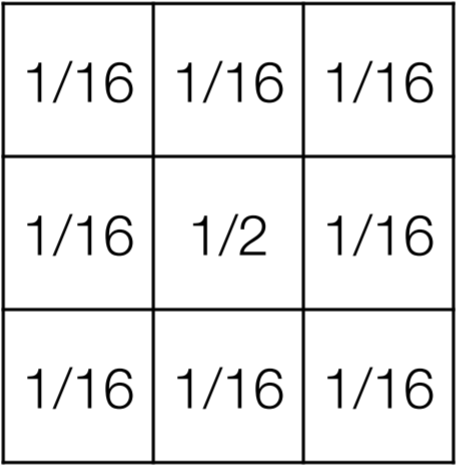

#### Prefiltering vs. Postfiltering

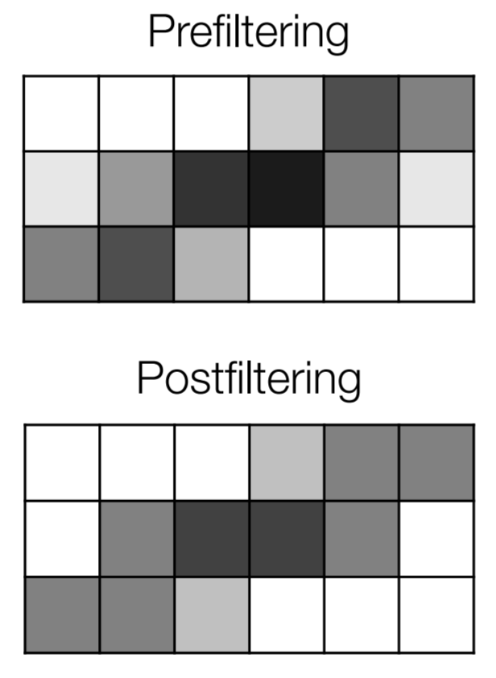

#### Stochastic sampling

The problem for supersampling in a grid is that still tends to produce noticeably regular aliasing effects. Adding small amounts of *jitter* to the sampled points makes aliasing effects appear as visual noise.

#### Double Sampling

Divide one pixel to four sub-pixels, and do the sampling on the nine according vertices.

#### Adpative Sampling

Supersampling in large areas of uniform color is wasterful, while it is most useful in areas of major color change. One solution to it is to sample recursively, at finer levels of detail in areas with more color variance.

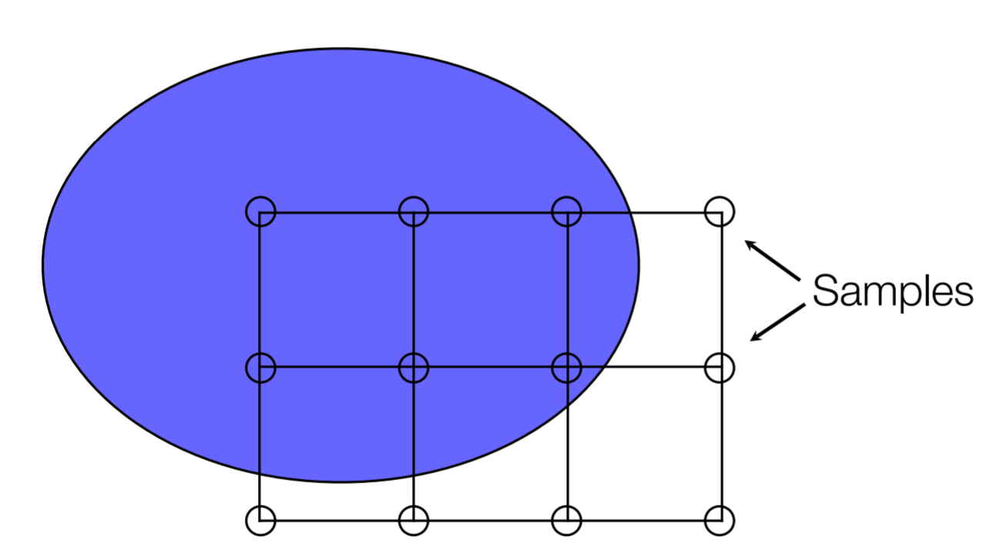
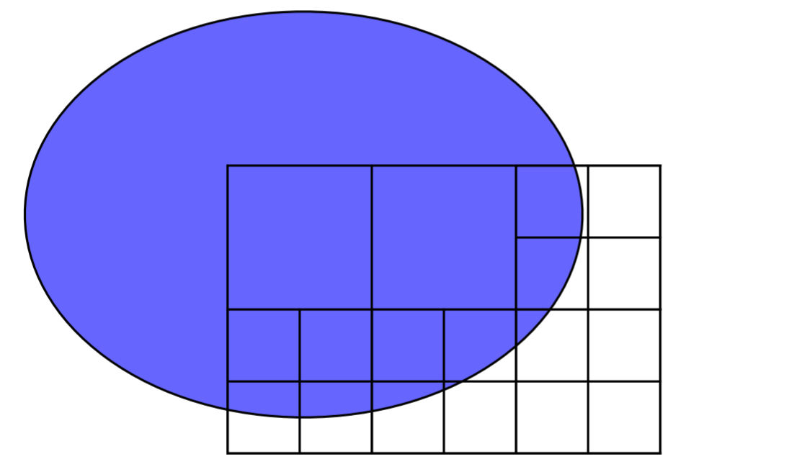
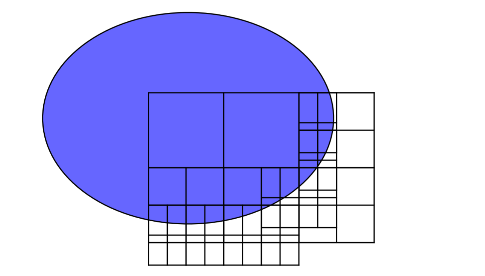

#### In `OpenGL`

```java
// Implementation dependant, may not even do anything
gl.glEnable(GL3.GL_LINE_SMOOTH);
gl.glHint(GL3.GL_LINE_SMOOTH_HINT, GL3.GL_NICEST);

// Also requires alpha blending
gl.glEnable(GL2.GL_BLEND);
gl.glBlendFunc(GL2.GL_SRC_ALPHA,
        GL2.GL_ONE_MINUS_SRC_ALPHA);

// Full-screen multi-sampling
GLCapabilities capabilities = new GLCapabilities();
// Has maximum number of samples
capabilities.setNumSamples(4);
capabilities.setSampleBuffers(true);
...
gl.glEnable(GL.GL_MULTISAMPLE);