# Week 7A Particle Systems, Ray Tracing

## Particle systems

Some visual phenomena (such as, raining, snowing, fire, smkoe and dust) are best modelled as *collections of small particles*.

Particles are usually represented as small textured quads or point sprites - single vertices with an image attached. They are *billboarded*.

> Billboarded here means they are transformed so that they are always face towards the camera.

Particles are created by an emitter object and evolve over time, usually changing position, size and color.

#### Billboarding

An approximate form of billboarding can be achieved by having polygons face a plane perpendicular to the camera.

#### Point Sprites

The textured sprite will be rendered in `OpenGL` using `GL_POINTS`. Points have postion (translation obv.), but no rotation nor scale (as it is a point after all), so are implicitly billboarded. The size of points can be set with `gl.glPointSize(int)`

## Particle evolution

The rules for particle evolution are:

* Interpolate from one color to another over time
* Move with constant speed or acceleration.

Since the equation involves the floating points calculation, to simulate many particles, it is important these updates steps are simple and fast.

#### Particles on the GPU

Particles systems are well suited to implementation as **vertex shaders**, where the particles can be represented as individual vertices. Moreover, a vertex shader can compute the position of each particle at each moment in time (obviously, particle system does not have to be fragements).

## Global lighting

The lighting we previously encountered only handled **direct lighting** from sources:

$$ I = I_a\rho_a + \sum_{l \in \text{lights}} I_l \Big(\rho_d(\hat{\textbf{s}_1} \cdot \hat{\textbf{m}}) + \rho_{sp} (\hat{\textbf{r}_1} \cdot \hat{\textbf{v}})^f \Big) $$

> Illumination = Ambient Light + Multiple_Light_Source (Diffuse Lihgt + Specular Light)

We added an ambient fudge term to account for all other light in the scene, without which surfaces might not be facing a light source are black (add more detail to the back face towards the light).

In reality, the light falling on a surface comes from everywhere. Light from one surface is reflected onto another surfaces and then another, an another and over and over again. The methods that take this kind of multi-bounce lighting into account are called **global lighting** methods.

#### Global lighting methods

There are two main methods for **global lighting**:

1. Raytracing: models specular reflection and refraction.
2. Radiosity: models diffuse reflection.

> Both methods are computationally expensive and are rarely suiable for real-time rendering.

[Unreal Engine](https://www.unrealengine.com/en-US)

## Ray tracing

Basic idea: Divide the screen into all pixels into the near clipping plane, and given a pixel, firing a ray from the camera through the pixel hitting the object, and fianlly assign the color for the pixel based on what color the ray is hitting on.

Ray tracing is a different approach to rendering than the pipeline (In the `OpenGL` pipeline we model objects as meshes of polygons which we convert into fragments and then display or not). On the contrary, in ray tracing, we model objects as *implicit forms* and compute each pixel by casting a ray and seeing which models it intersects.

#### Projective Methods vs. Raytracing

* Projective Methods:
  * For each **object** (might occupy multiple pixels): Find and update each pixel it influences
* Ray Tracing:
  * For each **pixel**: Find each object that influences it and update accordingly

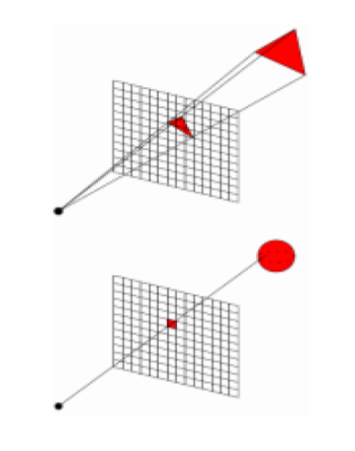

* They share lots of techniques:
  * Shading models
  * Calculation of intersections
* They also have tons of differences:
  * Projection and hidden surface removal come for 'free' in ray tracing

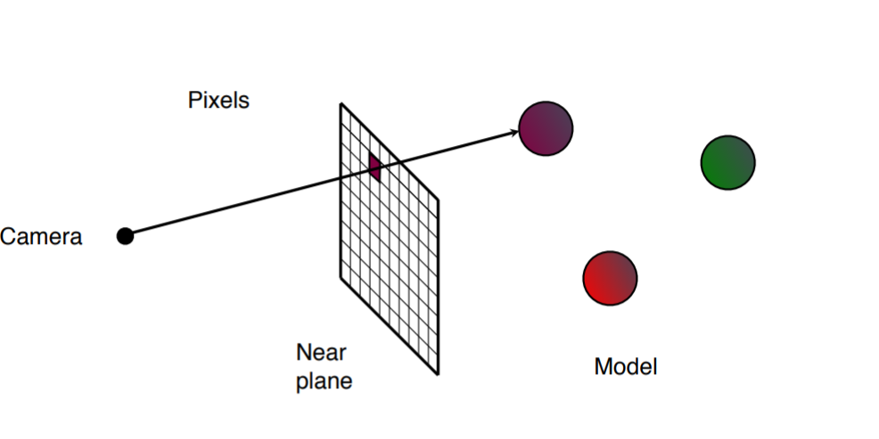

> ***For each pixels***

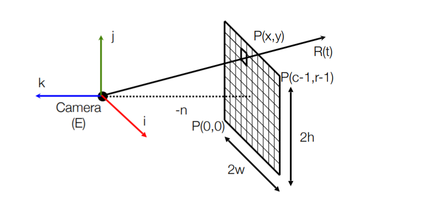

#### Locations of Pixels

Question: Where on the near plane does a given pixel (x,y) appear?


$$ \text{pixel width} = \frac{2w}{c} \\[2ex]
\begin{aligned}
\text{i}_c &= -w + x\big( \frac{2w}{c} \big) \\
    &= w \big( \frac{2x}{c} - 1 \big)
\end{aligned} \\[2ex]
\text{pixel height} = \frac{2h}{r} \\[2ex]
\text{j}_r = h\big(\frac{2y}{r} - 1 \big)
$$

where,
* $c$ is the number of columns
* $r$ is the number of rows
* $x$, $y$ differ from the traditional coordinate system, they are actually the (x,y) pixel from the near plane.
* $i_c$ is the coordinate value in near plane along the horizontal axis
* $j_r$ is the coordinate value in near plane along the vertical axis

#### Rays

The point P(x,y) of pixel (x,y) is given by:

$$ P(x,y) = E + i_c \textbf{i} + j_r \textbf{j} - n \textbf{k} $$

where,

* $E$ is the location of the camera
* $n$ is the how far the near plane is relative to the camera

A ray from the camera through P(x,y) is given by:

$$ \begin{aligned}
R(t) &= E + t(P(x,y) - E) \\
    &= E + t\textbf{v} \\
v &= i_c \textbf{i} + j_r \textbf{j} - n \textbf{k}
\end{aligned}
$$

When:
* $t=0$, we get E (Eye/Camera)
* $t=1$, we get P(x,y) - the point on the near plane - $E + \textbf{v}$
* $t>1$, point in the world
* $t<0$, point behind the camera - not on the ray, $E - k, k \in P$

#### Intersections

Now, to determine which the color the pixel shall be assigned to, we want to compute where this ray intersects with the objects in the scene.

For basic shapes, we can do this with the equation of the shape in **implicit form**:

$$ F(x,y,z) = 0 $$

which can also be writen as:

$$ F(P) = 0 $$

General idea is to substitutue the formula for the ray into $F$ and solve for $t$

#### Intersecting a generic sphere

For exmple, a unit sphere at the origin has implicit form:

$$ F(x,y,z) = x^2 + y^2 + z^2 - 1 = 0 \\[1ex]
OR \\[1ex]
F(P) = |P|^2 - 1 = 0 $$

$$ \begin{aligned}
F(R(t)) &= 0 \\
|R(t)|^2 - 1 &= 0 \\ 
|\textbf{E} + \textbf{v}t|^2 -1 &= 0 \\
|\textbf{v}|^2t^2 + 2(\textbf{E}\cdot \textbf{v})t + (|\textbf{E}^2-1) &= 0
\end{aligned}
$$

As the equation is quadratic, it is possible to get zero, one or two solutions:

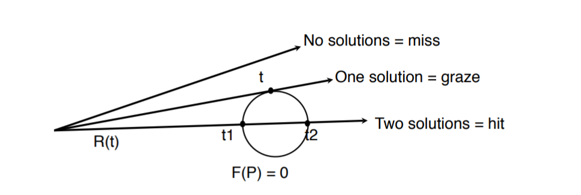

#### Intersecting a generic plane

> **Only the z-coordinate value matters**

The x-y plane has implicit form:

$$ \begin{aligned}
F(x,y,z) = z &= 0 \\
F(P) = p_z &= 0
\end{aligned} $$

Intersecting with the ray:

$$ \begin{aligned}
F(R(t)) &= 0 \\
\textbf{E}_z + t \textbf{v}_z &= 0 \\
t &= -\frac{\textbf{E}_z}{\textbf{v}_z}
\end{aligned} $$

#### Intersecting a generic cube

To compute the intersections with the generic cube, we first apply the `Cyrus-Beck clipping algorithm` with the algorithm extended to 3D. The algorithm can be used to compute intersection with arbitrary convex polyhedral and meshes of convex faces.

#### Intersecting a non-generic solids

The general idea to avoid writing special-purpose code to calculate intersections with non-generic spheres, boxes, planes, etc.

Instead, we can transform the ray and test it against the generic version of the shape.

## Transformed spheres

We can transform a sphere by applying *affine transformations*. Let P be a point on the generic sphere. We can then create an arbitrary ellipsoid by transforming P to a new coordinate frame given by a matrix M.

#### 2D Example

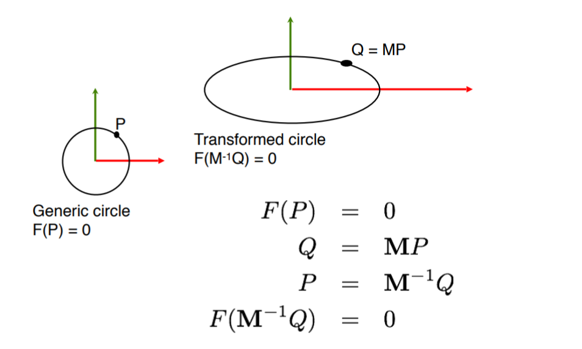

$$ \begin{aligned}
F(P) &= 0 \\
F(\textbf{M}^{-1}Q) &= 0 \\
Q &= \textbf{M}P
\end{aligned} $$

So in general if we apply a coordinate transformation **M** to a general solid with implicit equation F(P) = 0, we get:

$$ \begin{aligned}
F(\textbf{M}^{-1}Q) &= 0 \\
F(\textbf{M}^{-1}R(t)) &= 0 \\
F(\textbf{M}^{-1}E + t\textbf{M}^{-1}\textbf{v}) &= 0
\end{aligned} $$

> * Hence, it is really applying inverse transformation to the ray.
> * Do standard intersection with the generic form of the object
> * Affine transformations preserve relative distances so values of $t$ will be valid.

#### Pseudocode

```python
for each pixel (x,y):
    v = P(x,y) - E
    hits = {};
    for each object obj in the scene:
        E' = M^-1 * E
        v' = M^-1 * v
        hits.add(obj.hit(E', b'))
    hit = h in hits with min time > 1
    if hit is null:
        set (x,y) to background
    else:
        set (x,y) to hit.obj.color(R(hit.time))
```

#### 2D Example

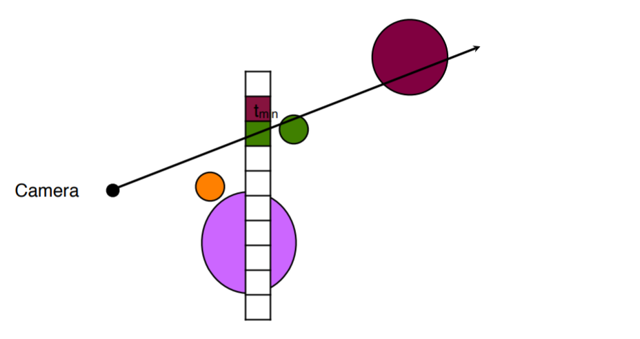
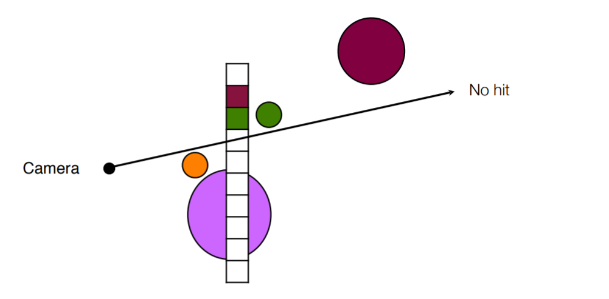
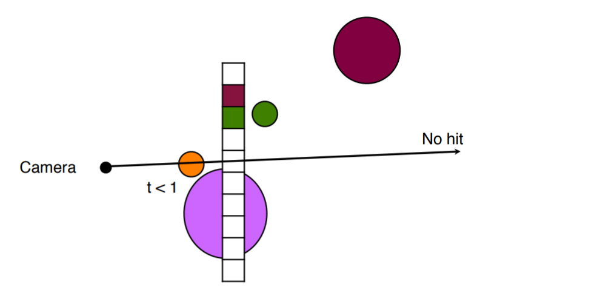
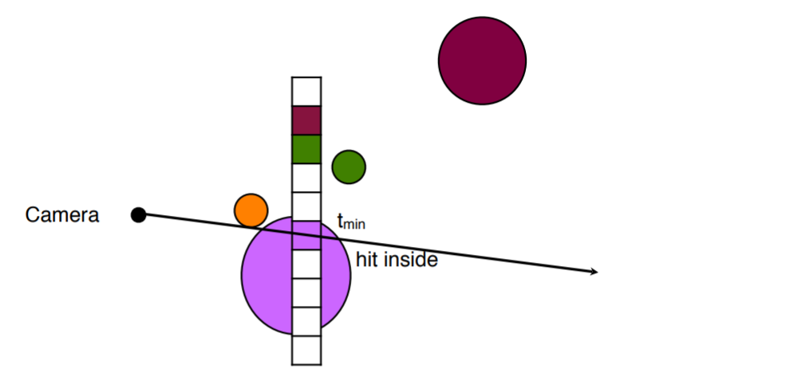

## Shading and Texturing

When we know the object hit and the point at which the hit occurs, we can compute the **lighting equation** to get the illumination as well as the texture coordinates for the hit point to calculate its color.

By combining these, we are able to compute the pixel color.

<br><br><br>

---

# Week 7B Application of Ray Tracing

## Shadows

One simple approach is, at each hit point, we cast a new ray towards each light source. These rays are called *shadow feelers*.

If a shadow feeler intersects an object before it reaches the source, then omit that source from the illumination equation for the point.

#### Self-shadows

The shadow feeler will always intersect the hit object at time $t=0$ (as the hit point is on the object itself). This intersection is only relevant if the light is on the opposite side of the object.

#### Example

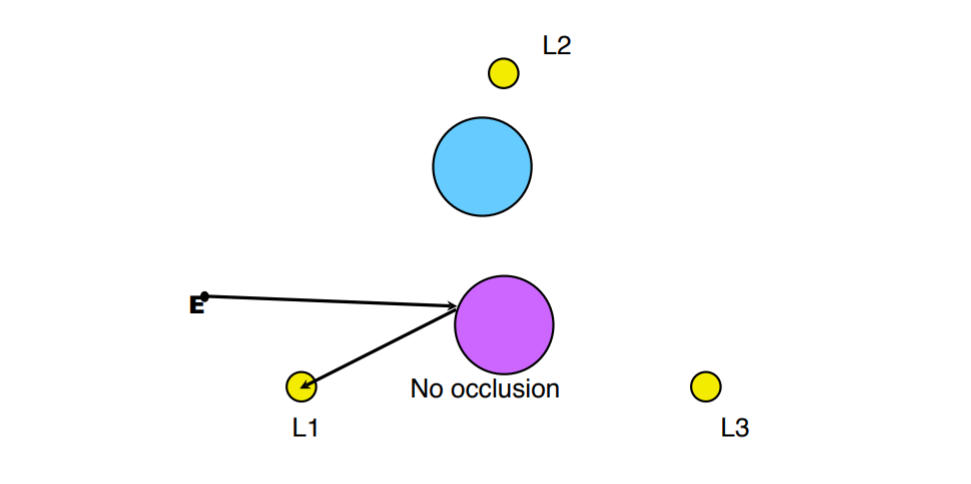
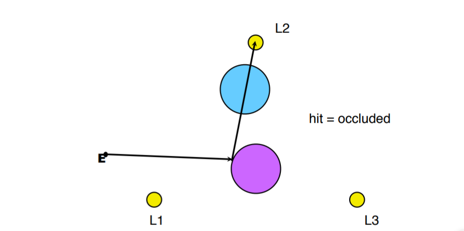
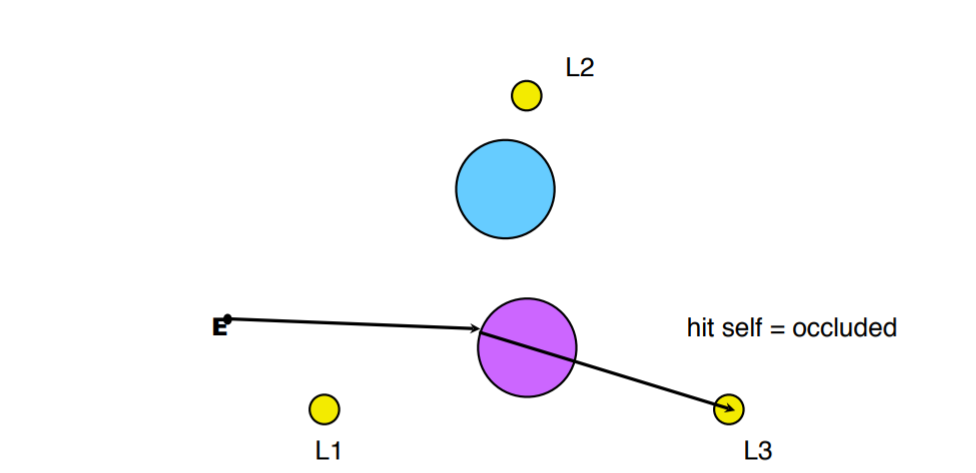

#### Pseudocode

```
Trace primary ray
if (hit is null)
    set (x,y) to background
else
    set (x,y) = ambient color
    Tracing secondary ray to each light
        if not blocked from light
            (x,y) += contribution from that light source
```

## Reflections

Realistic reflections can now be implemented by casting further reflected rays (ray tracing).

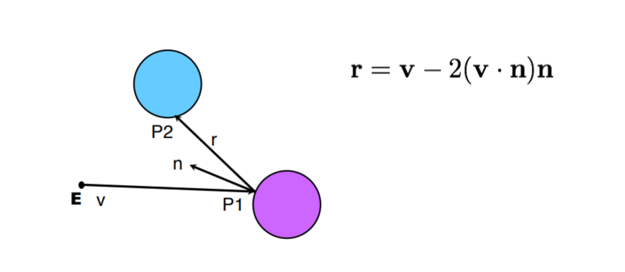

Reflected rays can in turn be reflected off another object and another. What needs to be **noted** here is that we usually write our code to stop after a fixed number of reflections to avoid infinite recursions.


> Mutiple number of bouncing reflection

## Transparency

We can also model transparent objects by casting a second ray that continues through the object (ray passing throug the transparent object)

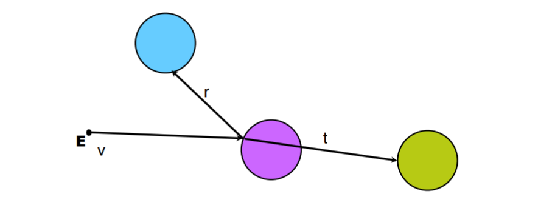

Transparency can also be applied reflexively, yeilding a tree of rays.

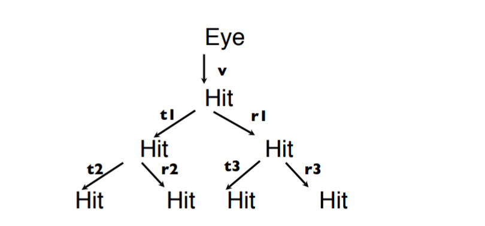

## Illumination

The illumination equation is extended to include reflected and transmitted components, which are computed recursively:

$$ I(P) = I_{amb} + I_{dif} + I_{spe} + I(P_{ref}) + I(P_{tra}) $$

where reflection and transparency are computed recursively. Yet, we still need material coefficients to attenuate the reflected and transimitted components appropriately.

## Refraction of Light

When a light ray strikes a transparent object, a portion of the ray penrtrates the object. The ray will change direction from the original direction (**dir**) to refracted direction (**t**) if the speed of light is different in medium 1 and medium 2. Vector **t** lies in the same plane as **dir** and the normal **m**.

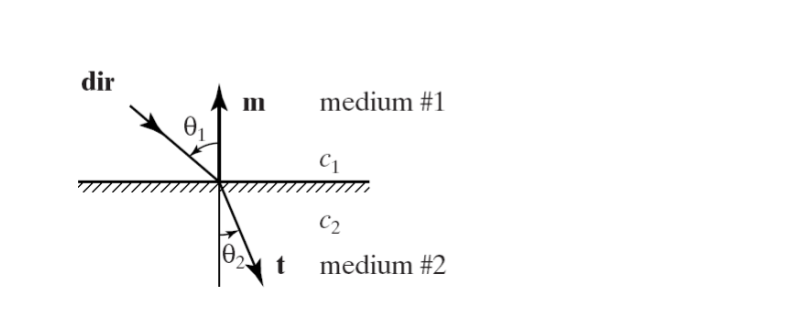

#### Refraction contributes to transparency

To handle transparency appropriately we need to take into account the refraction of light. Light bends as it moves from one medium to another. The change is described by `Snell's Law`:

$$ \frac{sin\theta_1}{c_1} = \frac{sin\theta_2}{c_2} $$

where $c_1$ and $c_2$ are the speeds of the light in each medium

#### Refraction

By rearranaging the `Snell's Law`

$$ \frac{sin\theta_1}{c_1} = \frac{sin\theta_2}{c_2} \\[1ex]
\frac{c_1}{c_2} = \frac{sin\theta_1}{sin\theta_2} $$

As, $0 < \theta < 90$. Hence, if

* c1 > c2, so as to $\frac{c1}{c2} > 1$, $\frac{sin\theta_1}{sin\theta_2} > 1$
* c1 < c2, so as to $0 <\frac{c1}{c2} < 1$, $0 < \frac{sin\theta_1}{sin\theta_2} < 1$

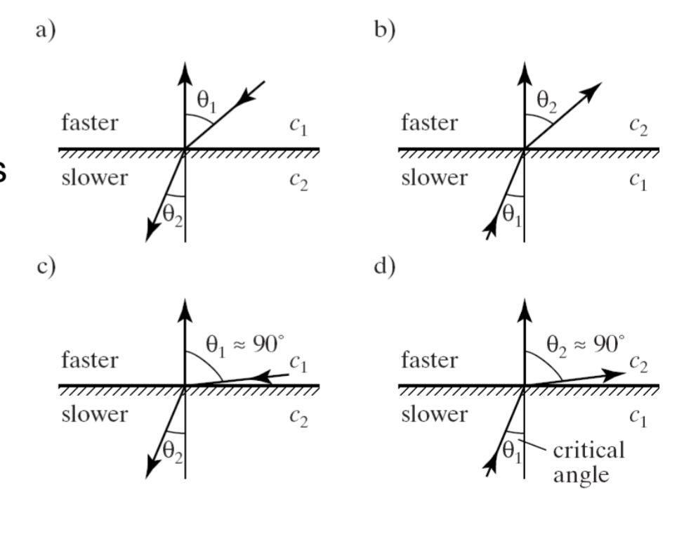

* In (c) and (d), the larger angle has become nearly 90 degree. The smaller angle is near the critical angle: when the smaller angle (of the slower medium) gets large enough, it forces the larger angle to 90 degree. A larger value is impossible, so no light is transmitted into the second medium. This is called **total internal reflection**. Noted: there is where reflection happens instead of refraction.

#### Wavelength contributes to refraction

Different wavelengths of light move at different speeds (except in a vacuum). So for maximum realism, we should calculate different paths for different colors.

> Taking sunlight passing through a raindrop as example

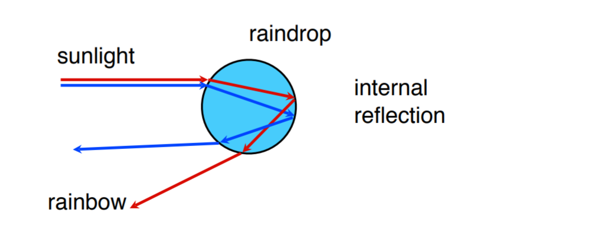

To implement a transparent model, the exact way would be that trace separate rays for each of the color components, as they would refract in different directions. This would be expensive computationally, and would still provide only an approximation, because an accurate model of refraction should take into account a large number of colors, not just three three primaries (RGB).

However, there is one of the simplest approach is to model transparent objects so that their index of refraction does not depend on wavelength.

#### Optimisation

Testing collisions for more complex shapes (such as meshes) can be very time consuming. In a large scene, most rays will not hit the object, so performing multiple expensive collision tests is wasteful. Hence, we are required to find a fast way to rule out objects which will not make any difference to the scene (not be hit).

## Optimisation - Extents

> Extents are bounding boxes or spheres which enclose an object

Testing against a box or sphere is fast. If this test succeeds, then we proceed to test against the object. To keep the deviation as less as possible (minise false positive), we want tight fitting extents.

#### Examples

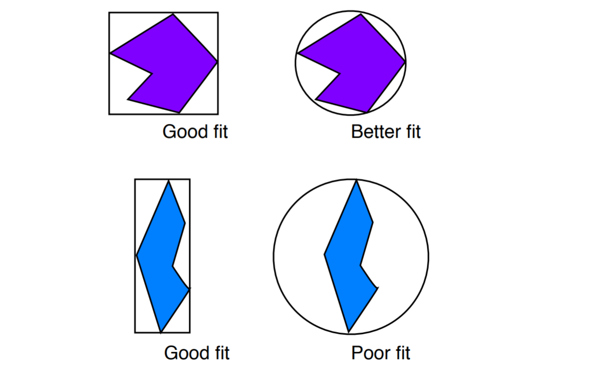

#### Computing extents

* To compute a **box extent** for a mesh we simply take the min and max for the `x`, `y` and `z` components over all the points.
* To compute a **sphere extent** we find the centroid of all the vertices by averaging their coordinates, This is the centre of the sphere. the radius is the distance to the vertex farthest from this point

#### Projection extents

Alternatively, we can build extents in screen space rather than world space.

A projection extent of an object is bounding box which encloses all the pixels which would be in the image of the object (ignoring occlusions). Pixels outside this box can ignore the object. Does not work for the shadow feelers or reflected rays.

We can compute a projection extent of a mesh by projecting all teh vertices into screen space and finding the min adn max `x` and `y` values.

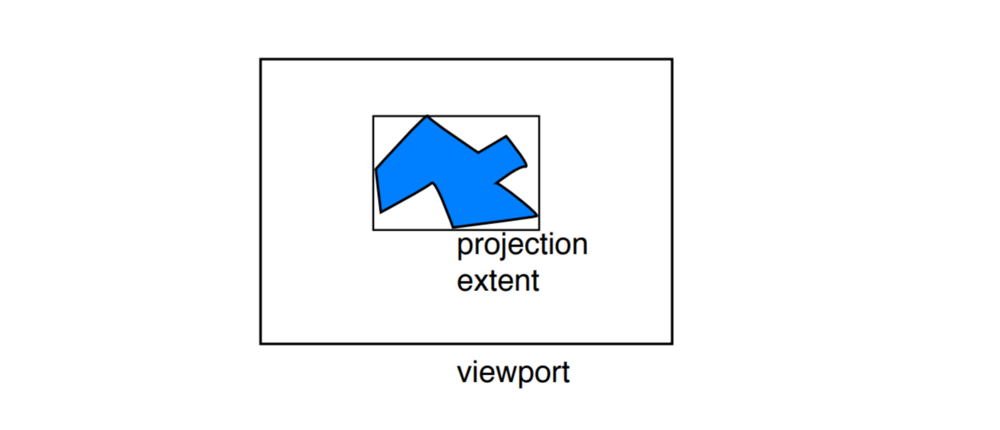

## Optimisation - Binary Space Partitioning

Another approach to optimisation is to build a Binary Space Partitioning (BSP) tree dividing the world into cells, where each cell contains a small number of objects.

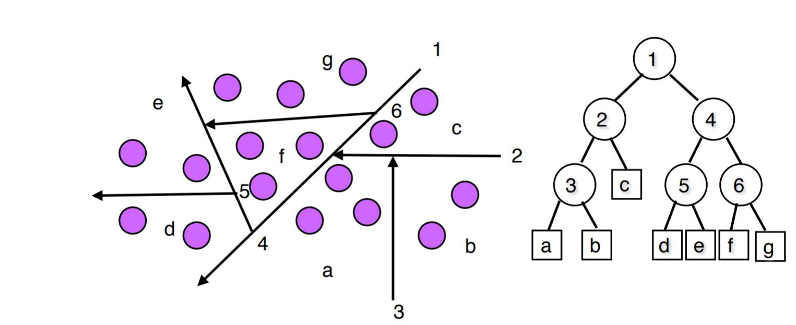