# Week 8A Radiosity, Color

## Radiosity

**Radiosity takes into account light from all objects in the room, not just light sources. This means that shadows are much softer and realistic because it takes into account light from very many angles. As a result, the computational cost is much higher and this approach is typically not suited fo real-time rendering. However, the results of radiosity calculations can be baked into static light-maps and used in real time situations if the lights and objects in the scene are not moving.**

> Radiosity is a global illumination technique that performs indirect diffuse lighting.

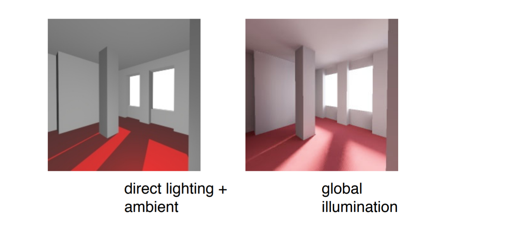

* Direct lighting techniques only take into account light coming directly from a source.
* Raytracing takes into account specular reflections of other objects. 
* Radiosity takes into account diffuse reflections of everything else in the scene.

#### Ray tracing vs. Radiosity

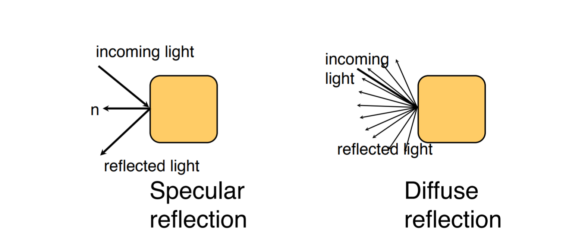
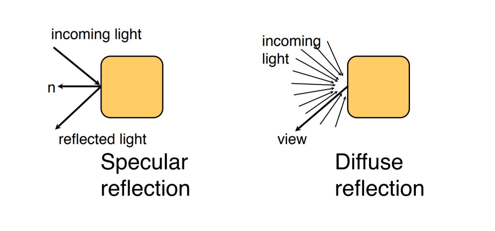

#### Finite elements

We can solve the radiosity problem using a finite element method by dividing the scene up into small patches. Then calculate the energy transfer from each patch to every other patch.

#### Energy transfer

The basic equation for energy transfer is:

$$ \text{Light output} = \text{Light emitted} + \rho * \text{Light input} $$

where $\rho$ is the diffuse reflection coefficient.

The light input to a patch is a weighted sum of the light output by every other patch:

$$ B_i = E_i + \rho_i \sum_j B_j F_{ij} $$

where,

* $B_i$ is the radiosity of patch $i$
* $E_i$ is the energy emitted by patch $i$
* $\rho_i$ is the reflectivity of patch $i$
* $F_{ij}$ is a form factor which encodes what fraction of light from patch $J$ reaches patch $i$

#### Form factors

The **form factors** $F_{ij}$ depend on:

* the shape of patches $i$ and $j$
* the distance between the patches
* the relative orientation of the patches

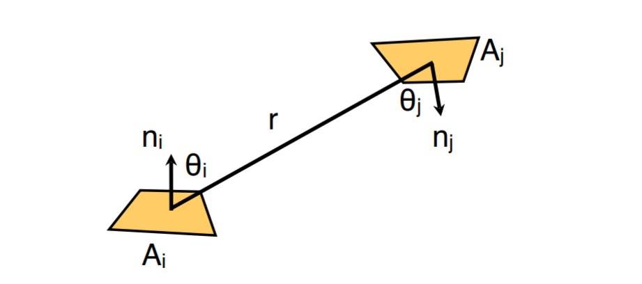

Mathematically:

$$ F_{ij} = \frac{1}{A_i} \int_{A_i} \int_{A_j} \frac{cos\theta_i cos\theta_j}{\pi r^2} d A_j d A_i $$

Calculating from factors in this way is difficult and does not take into account occlusion.

#### Nusselt Analog

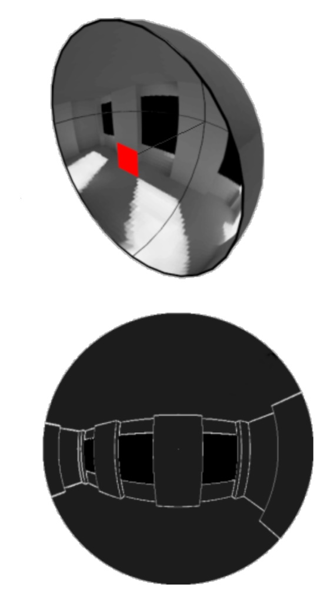

An easier equivalent approach:

1. render teh scene onto a **unit hemisphere** from the patch's point of view
2. project the hemisphere orthographically on a unit circle
3. divide by the area of the circle

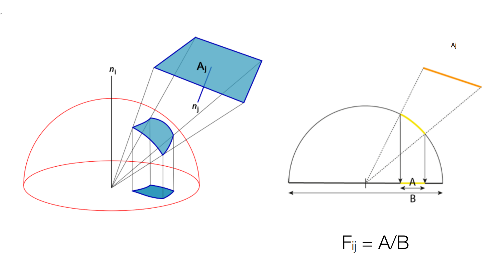

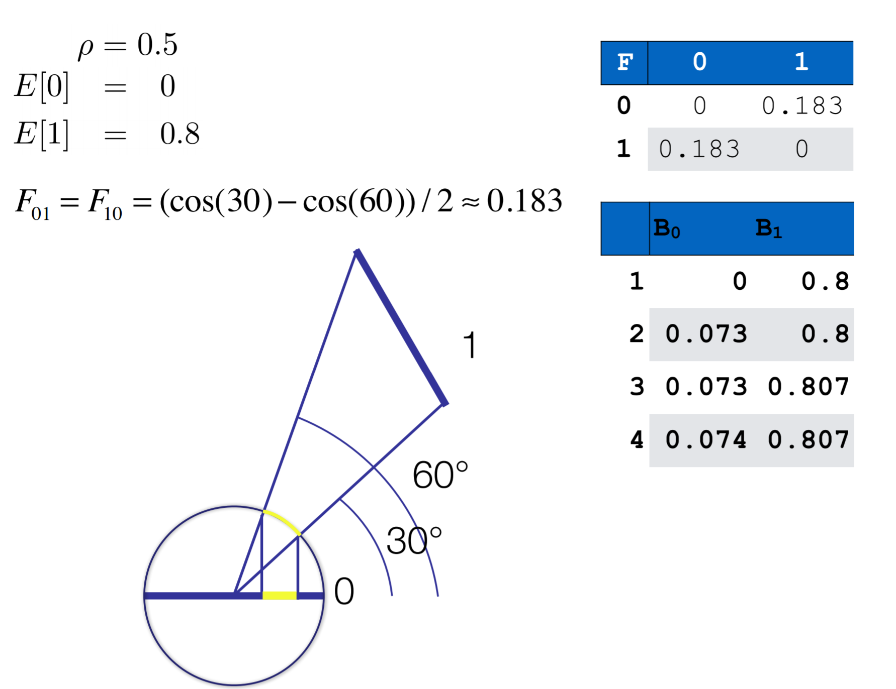

#### The hemicube method

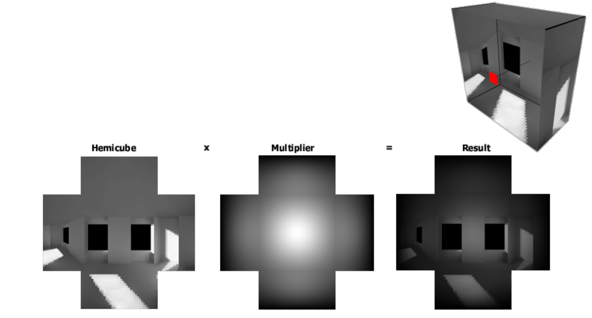

A simpler method is to render the scene onto a hemicube and weight the pixels to account for the distortion.

##### Solving

We can view the radiosity equation as a system of linear equations:

$$ B_i = E_i = \rho_i \sum_j B_j F_{ij} $$

$$ \begin{aligned}
B_1 &= E_1 + \rho_1 (B_1F_{11} + B_2F_{12} + \cdots + B_NF_{1N}) \\
B_2 &= E_2 + \rho_2 (B_2F_{21} + B_2F_{22} + \cdots + B_NF_{2N}) \\
&\ \ \vdots \\
B_N &= E_N + \rho_N (B_1F_{N1} + B_2F_{N2} + \cdots + B_NF_{NN})
\end{aligned} $$

Equivalently, the equation can be expressed as a matrix

$$ \begin{pmatrix}
    1-\rho_1F_{11} & -\rho_1F_{12} & \cdots & \rho_1F_{1N} \\
    -\rho_2F_{21} & 1-\rho_2F_{22} & \cdots & \rho_2F_{2N} \\
    \vdots & \vdots & \ddots & \vdots \\
    -\rho_NF_{N1} & -\rho_NF_{N2} & \cdots & 1-\rho_NF_{NN}
\end{pmatrix} 
\begin{pmatrix}
    B_1 \\ B_2 \\ \vdots \\ B_N 
\end{pmatrix}
= \begin{pmatrix}
    E_1 \\ E_2 \\ \vdots \\ E_N 
\end{pmatrix}$$

#### Interactive approximation

One simple solution is merely to update the radiosity values in multiple passes:

```
for each interaction:
    for each patch i:
        Bnew[i] = E[i]
        for each patch j:
            Bnew[i] += rho[i] * F[i,j] * Bold[j];
    swap Bold and Bnew
```

Using direct rendering

```
for each interaction:
    for each patch i:
        Bnew[i] = E[i]
        S = RenderScene(i, Bold)
        B = sum of pixels in S
        Bnew[i] += rho[i] * B
    swap Bold and Bnew
```

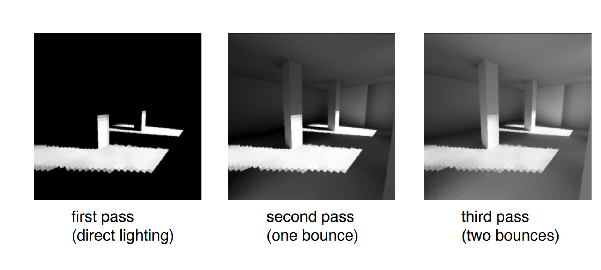

##### $\text{16}^\text{th}$ Pass

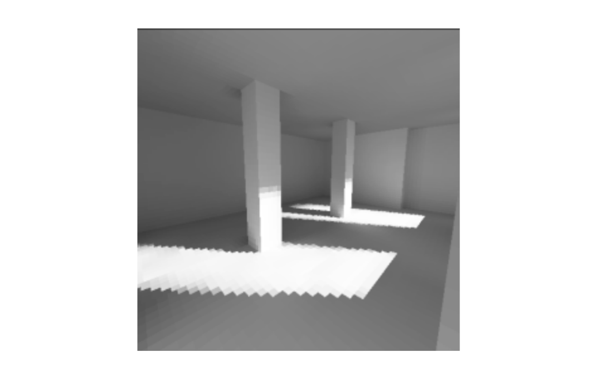

#### Progressive refinement

The iterative approach is inefficient as it spends a lot of time computing inputs from patches that make minimal or no contribution.

A better approach is to prioritise patches by how much light they output, as these patches will have the greatese contribution to the scene

```
for each patch i:
    B[i] = dB[i] = E[i]
iterate:
    select patch i with max dB[i]:
    calculate F[i][j] for all j
    for each patch j:
        dRad = rho[j] * B[i] * F[i][j] * A[j] / A[i]
        B[j] += dRad
        dB[j] += dRad
    dB[i] = 0
```

#### In practice

Radiosity is computationally expensive, so rarely suitable for real-time rendering. However, ti can be used in conjunction with light mapping.

#### Geometric light sources

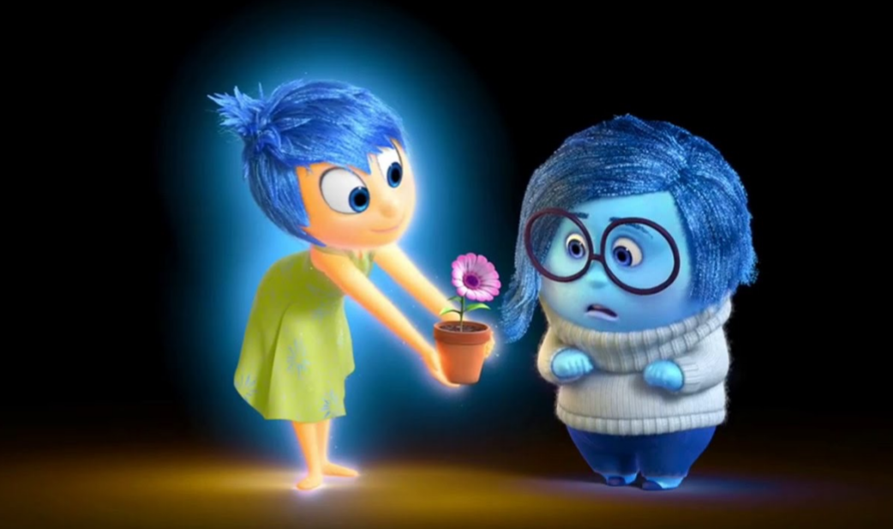

#### Path Tracing (NOT EXAMIABLE) 
Path tracing uses a `Monte Carlo` method to accurately approximate global illumination.

[Monte Carlo](https://www.scratchapixel.com/lessons/mathematics-physics-for-computergraphics/monte-carlo-methods-in-practice/)

[Path tracing](https://www.scratchapixel.com/lessons/3d-basic-rendering/global-illuminationpath-tracing)

#### Other further information (NOT EXAMIABLE)

[Real time Gloabl illumination]( https://www.shadertoy.com/view/XdtSRn)

[Real time radiosity on Unreal 4](https://www.youtube.com/watch?v=BmOppCTh1nA)

#### References

* http://freespace.virgin.net/hugo.elias/radiosity/radiosity.htm
* http://www.cs.uu.nl/docs/vakken/gr/2011/gr_lectures.html
* http://www.siggraph.org/education/materials/HyperGraph/radiosity/overview_2.htm
* http://http.developer.nvidia.com/GPUGems2/gpugems2_chapter39.html

## Color

Color involves:

* Physics of light
* Electromagnetic radiation
* Biology of the eye
* Neuropsychology of the visual system

#### Physics of light

Light is an electomagnetic wave, the same as radio waves, microwaves, X-rays and etc. The visible specturm consists of waves with wavelength between 400 and 700 nanometers.

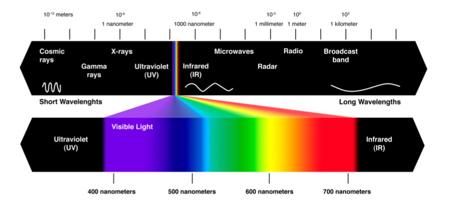

#### Non-spectral colors

Some light sources, such as lasers, emit light of essentially a single wavelength or "pure spectral" light (red, violet and colors of the rainbow)

Other colors (e.g., white, purple, pink, brown) are non-spectral. There is no single wavelength for these colors, rather they are mixtures of light of different wavelengths.

#### Color blending

As a result of this, different mixtures of light will appear to have the same color, because they stimuate the cones in the same way (e.g., a mixture of red and green light will appear to be yellow).

We can take advantage of this in a computer by having monitors with only red, blue and green phosphors in pixels.

Other colors are made by mixing these light together.

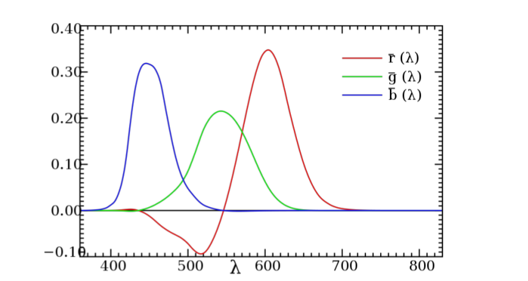

The graph shows that now all colors can be made by adding primaries, as some color require a negative amount of one of the primaries (typically red).

#### Algebratically

Algebratically, we write:

$$ C = r\text{R} + g\text{G} + b\text{B} $$

to indicate that color C is equivalent $r$ units of red, $g$ units of green and $b$ units of blue.

A color with wavelength 500nm has:

$$ C = -0.30\text{R} + 0.49\text{G} + 0.11\text{B} $$

can be rearranged as:

$$ C + 0.30\text{R} = 0.49\text{G} + 0.11\text{B} $$

So if we add 0.3 units of red to color C, it will look the same as the given combination of green and blue.

#### References

* https://graphics.stanford.edu/courses/cs178/applets/locus.html
* https://graphics.stanford.edu/courses/cs178/applets/locus.html


<br><br><br>

---

# Week 8B Postprocessing Splines

## Postprocessing

Postproessing is basically adding visual effects (lighting, coloring, stylisation and etc) after the scene has alreday been rendered. This can be achieved by techniques from image proessing.

> Modren games rely on this heavily

## Frame Buffer Object

The `framebuffer` `OpenGL` gives us by default is very limited in most implementations with:

* No alpha channel
* Only 8 bits per color channel
* Limited precision depth buffer

We can create our own frame buffer objects with:

```java
int[] fbos = new int[1];
gl.glGenFramebuffers(1, fbos, 0);
```

In order to use the frame buffer we have to attach to it at least a color buffer and optionally a depth or other buffers.

A color buffer can just be regular texture

```java
gl.glTexImage2D(
    GL.GL_TEXTURE_2D, 
    0,
    GL.GL_RGBA,
    width,
    height,
    0,
    GL.GL_RGBA,
    GL.GL_UNNSIGNED_BYTE,
    null
);

gl.glFramebufferTexture2D(
    GL.GL_FRAMEBUFFER,
    GL.GL_COLOR_ATTACHMENT0,
    GL.GL_TEXTURE_2D,
    texID,
    0
)
```

## Render Buffer

A render buffer is like a texture, but there's no way to read fro mit within a shader. `OpenGL` is free to store it in whatever format works best for that implementation.

```java
// Render buffer giving 24 bits for depth
int [] rbos = new int[1];
gl.glGenRenderbuffers(1, rbos, 0);
gl.glBindRenderbuffer(GL.GL_RENDERBUFFER, rbos[0]);
gl.glRenderbufferStorage(GL.GL_RENDERNBUFFER,
    GL.GL_DEPTH_COMPONENT24,
    width, height
);
```

It still needs to be attached to the FrameBufferObject
```java
gl.glFramebufferRenderbuffer(
    GL.GL_FRAMEBUFFER,
    GL3.GL_DEPTH_ATTACHMENT,
    GL.GL_RENDERBUFFER,
    rbos[0]
);
```

## Stencli operations

> Computing new values based on surrounding values

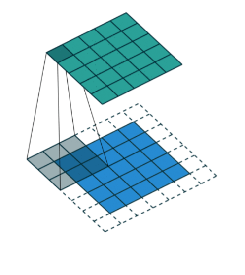

For values on the edge, do `GL_CLAMP_TO_EDGE`

## Sobel operator

Multiply each element in the 3 by 3 neighbourhood with this kernel to get the derivative in the x-direction

Then this kernel to get the derivative in the y-direction

Using the derivates, calculate the total magnitude for each color component

If the magnitude for a color component is greater than some threshold, treat it as an edge.

## Gaussian blur

Uses a Gaussian distribution to combine each pixel with its neighbours. The pixel itself is weighted most, and nearby pixels weighted depending on their distance from it.

Best done in 2 passes:

* Blur in the x-direction (9 $\times$ 1 kernel)
* Then blur in the y-direction (1 $\times$ 9 kernel)

Further blurring can be achieved by using a large kernel or by repeating the process.

## Bloom filter

Combines multiple post-processing steps:

1. Extract bright regions
2. Blur bright regions
3. Draw original scene to screen
4. Draw blurred brightness on top

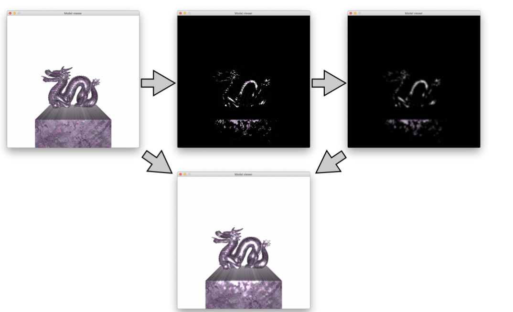

## Hight Dynamic Ranger (HDR)

By using FBOs, we can render into buffers with more color detail (e.g., 16 bits per color channel instead of 8)

```java
gl.glTexImage2D(
    GL.GL_TEXTURE_2D, 
    0,
    GL.GL_RGBA16F,
    width,
    height,
    0,
    GL.GL_RGBA,
    GL.GL_UNNSIGNED_BYTE,
    null
);
```

#### Tone mapping

To render to the screen, this color information has to be ampped to the conventional 8 bits per channel. This process is refferred to as tone mapping

Different tone mappings can do things like reduce overall brightness or enhance certain colors

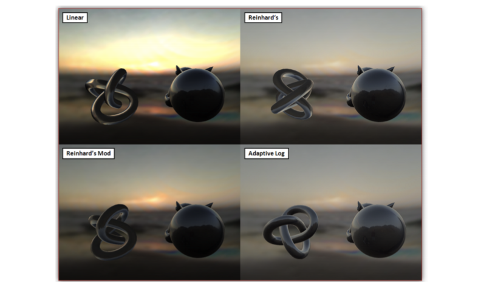

[More details](https://learnopengl.com/Advanced-Lighting/HDR)

## Ambient Occlusion

Approximates indirect lighting by identifying small holes, crevices and gaps (i.e., places light does not get into) and making them darker.

Most common form is Screen-Space Ambient Occlusion (SSAO).

Relies upon being able to read from the depth buffer after a scene has been rendered. For each pixel that has alread been rendered, calculated an occlusion factor based on the depth of it and the depth of surrounding pixels (looks best if picked randomly from a sphere).

If more than half of the random samples taken from a sphere are blocked by a value in the depth buffer then the pixel will be darkened.

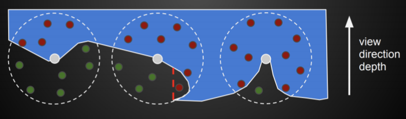

> Is inaccurate as it assumes geometry doesn't have gaps in the Z-direction

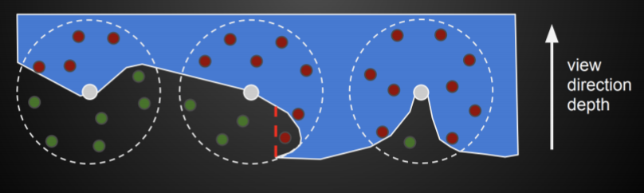

[More info](https://learnopengl.com/Advanced-Lighting/SSAO)

## Deferred Shading

It's common with postprocessing to need information about a pixel other than its color or its depth.

In deferred shading we render the scene into multiple buffers contain basic information (e.g., position, normal, specular, depth).

The G-Buffr refers to all the different buffers generated.

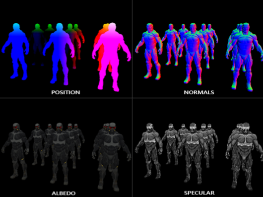

Actual lighting calculations can be deferred to a postprocessing step

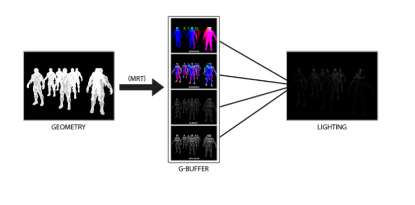

#### Advantages and disadvantages

* Advantage:
  * Decoupling of scene geometry from lighting.
  * Giving the ability to render many lights in a scene without a significant performance-hit.
* Disadvantage:
  * Inability to handle transparency within the algorithm


[More info](https://learnopengl.com/Advanced-Lighting/Deferred-Shading)