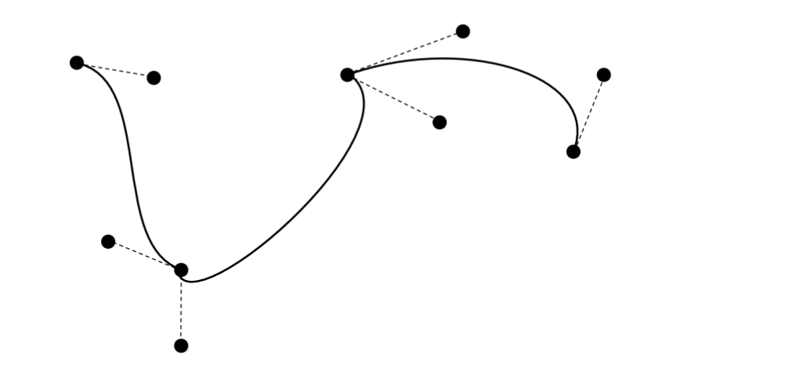
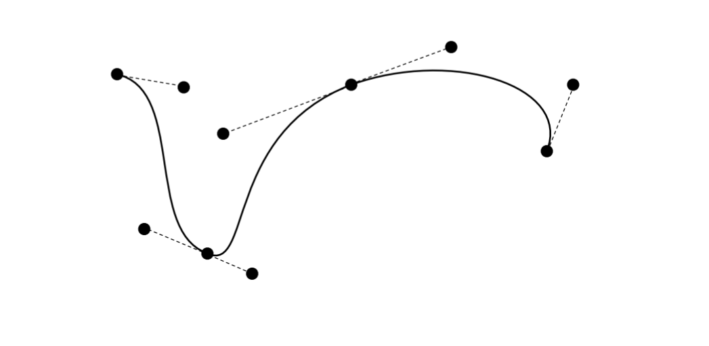
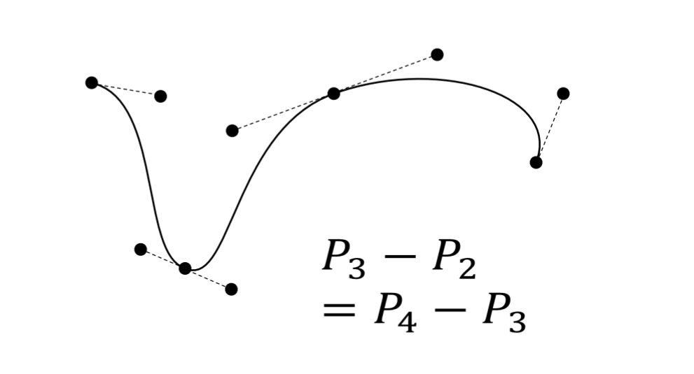

# Week 9A Splines, Extension Material

## Problem of Bezier Curves

* **Local control**: Moving one control point affects the entire curve.
* **Incomplete**: No circle, elipses, conic sections and etc.

#### Local control

These curves suffer from non-local control. Moving one control point will also affect the entire curve.

Additionally, each berstein polynomial is active (non-zero) over the entire interval [0,1]. The curve is a blend of these functions so every control point has an effect on the curve for all t from [0,1]

## Splines

> A spline is a smooth piecewise-polynomial function (for some measurement of smoothness). 
> The place where the polynomials join are called **knots**

A joined sequence of Bezier curves is an example of a spline.

#### Local control

A spline provides local control. A control point only affects the curve within a limited neighbourhood.

#### Bezier splines

We can draw longer curves as sequences of Bezier sections with common endpoints:

#### Parametric Continuity

A curve is said to have $\textbf{C}^n$ continuity if the *nth derivative* is continuous for all $t$:

$$ v_n(t) = \frac{d^nP(t)}{dt^n} $$

$\textbf{C}^0$: the curve is connected. 
$\textbf{C}^1$: a point travelling along the curve doesn't have any instantaneous changes in velocity. 
$\textbf{C}^2$: no instantaneous changes in acceleration

#### Geometric Continuity

A curve is said to have $\textbf{G}^n$ continuity if the *normalised derivative* is continuous for all $t$:

$$ \hat{\textbf{v}}_n(t) = \frac{\textbf{v}_n(t)}{|\textbf{v}_n(t)|} $$

$\textbf{G}^1$: means tangents to the curve are continuous. 
$\textbf{G}^2$: means the curve has continuous curvature.

#### Summary on continuity

* Geometric continuity is important if we are drawing a curve
* Parametric continuity is important if we are using a curves as a guide for motion

#### Cont. Bezier splines

* If the control points are *collinear*, the curve has $\textbf{G}^1$ continuity.
  
* If the control points are collinear and *equally spaced*, then the curves has $\textbf{C}^1$ continuity:
  

## B-splines

Bezier splines can be generalised into a large class called *basis splines* or *B-splines*

A B-spline of degree m has equation:

$$ P(t) = \sum_{k=0}^L N_k^m(t) P_k $$

where L is the number of control points, with $L>m$

#### Coefficient function

The $N_k^m(t)$ funtion is defined recursively:

$$ \begin{aligned}
N_k^m(t) &= \bigg( 
    \frac{t-t_k}{t_{m+k}-t_k} \bigg)N_k^{m-1}(t) \\ +\bigg( \frac{t_{m+k+1}-t}{t_{m+k+1}-t_{k+1}} \bigg)N_{k+1}^{m-1}(t) \\
N_k^0(t) &= 1  \text{ if } t_k < t \le t_{k+1} \\
N_k^0(t) &= 0  \text{ otherwise}
\end{aligned} $$

## Knot vector

The sequence ($t_0$, $t_1$, ... , $t_{m+L}$) is called the *knot vector*. The knots are ordered so $t_k \le t_{k+1}$. Knots mark the limits of the influence of each control point. Control point $P_k$ affects the curve between knots $t_k$ and $t_{k+m+l}$

#### Number of Knots

The number of knots in the knot vector is always equal to the nu,ber of control points plus the order of the curve.

For example, a cubic (m = 3) with five control points have 9 items in the knot vector:

(0, 0.125, 0.25, 0.375, 0.5, 0.625, 0.75, 0.875, 1)

## Uniform/Non-uniform

Uniform B-splines have *equally spaced* knots. Non-uniform B-splines allow knots to be positioned arbitrarily even and repeat.

A *multiple knot* is a knot value that is repeated several times. Mutiple knots created discontinuities in the derivatives.